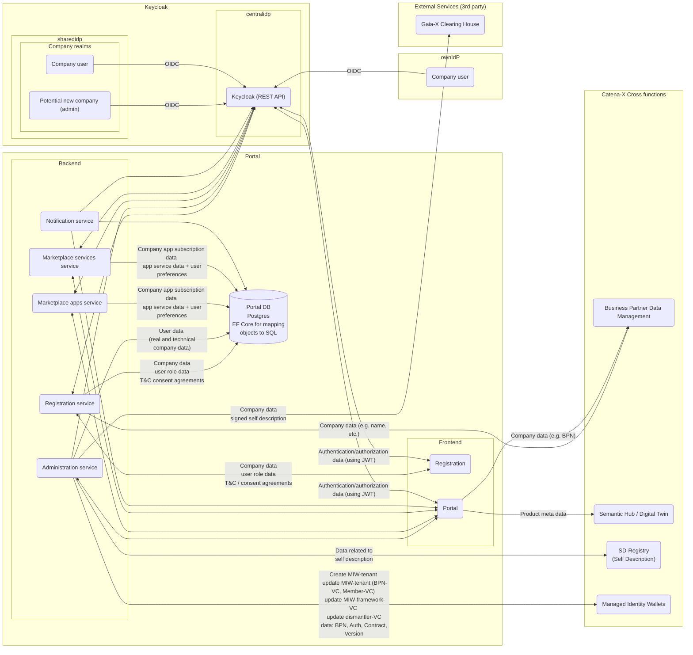

# Security Assessment Portal (incl. Frontend, Backend Services, IAM and other infrastructure)

|     |     |
| --- | --- |
| Contact for product        | [@evegufy](https://github.com/evegufy)   [@jjeroch](https://github.com/jjeroch) |
| Security responsible       | [@SSIRKC](https://github.com/SSIRKC)   [Szymon Kowalczyk](szymon.kowalczyk.external@zf.com) |
| Version number of product  | 23.12 |
| Dates of assessment        | 2023-11-14: Re-Assessment |
| Status of assessment       | RE-ASSESSMENT DRAFT |

## Product Description

The Catena-X Portal and Marketplace is the heart of Catena-X and the entry point for all activities in the automotive network/value chain.
Every user of the automotive value chain, no matter if it is a consumer, app provider, IT administrator or IT support will connect via the portal to the value bringing services.
The whole eco-system on the automotive value chain is connected at one place.
* Portal Frame
* Partner Onboarding Process (initial, technical & business)
* Login Process
* User Management
* App Store
* Developer Platform
* UI / UX & Developer Guidelines

### Important Links

- [portal-frontend](https://github.com/eclipse-tractusx/portal-frontend)
- [portal-frontend-registration](https://github.com/eclipse-tractusx/portal-frontend-registration)
- [portal-shared-components](https://github.com/eclipse-tractusx/portal-shared-components)
- [portal-assets](https://github.com/eclipse-tractusx/portal-assets)
- [portal-backend](https://github.com/eclipse-tractusx/portal-backend)

## Data Flow Diagram

### Changes compared to last Security Assessment

* No major architectural changes that introduce new threats.
* Main changes are connections to the onboarding service provider.

### Features for Upcomming Versions

* Integration of onboarding service provider endpoints.

## Threats & Risks

All threats identified are mitigated.
