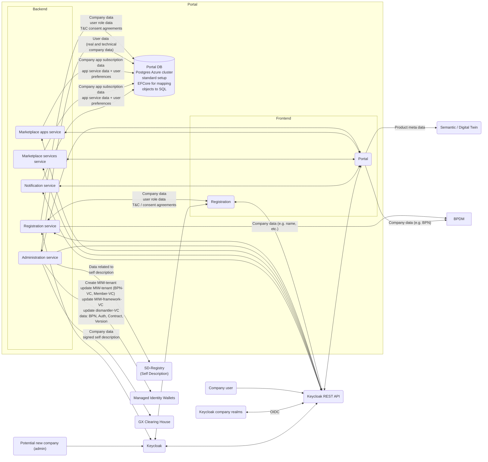

# Security Assessment

## Data Flow Diagram

```mermaid
%%{
  init: {
    'flowchart': { 'diagramPadding': '10', 'wrappingWidth': '', 'nodeSpacing': '', 'rankSpacing':'', 'titleTopMargin':'10', 'curve':'basis'},
  }
}%%
flowchart LR

    RF("Registration")
    PF("Portal")

    RS(Registration service)
    AS(Administration service)
    MAS(Marketplace apps service)
    MSS(Marketplace services service)
    NS(Notification service)

    BPDM
    SDT(Semantic / Digital Twin)
    SDR("SD-Registry \n (Self Description)")
    MIW(Managed Identity Wallets)
    NC("Potential new company (admin)")
    CU(Company user)

    K(Keycloak)
    KAPI(Keycloak REST API)
    KCR(Keycloak company realms)

    subgraph Portal
        subgraph Frontend
        RF
        PF
        end
        subgraph Backend
        RS
        AS
        MAS
        MSS
        NS
        end
    PDB[(Portal DB \n Postgres Azure cluster \n standard setup \n EFCore for mapping \n objects to SQL)]
    end
  
    RS <-->|Company data \n user role data \n T&C / consent agreements| RF
    RS <--> KAPI
    RS <--> K
    RS -->|Company data \n user role data \n T&C consent agreements| PDB
    RS -->|"Company data (e.g. name, etc.)"| BPDM

    AS --> KAPI
    AS <--> PF
    AS -->|"User data \n (real and technical company data)"| PDB
    AS -->|Data related to \n self description| SDR
    AS -->|"Create MIW-tenant \n update MIW-tenant (BPN-VC, Member-VC) \n update MIW-framework-VC \n update dismantler-VC \n data: BPN, Auth, Contract, Version"| MIW
    AS -->|Company data \n signed self description| CH

    MAS -->|Company app subscription data \n app service data + user preferences| PDB
    MAS <--> KAPI
    MAS <--> PF

    MSS <--> PF
    MSS <--> KAPI
    MSS -->|Company app subscription data \n app service data + user preferences| PDB

    NS -->PDB
    NS <--> PF
    NS <--> KAPI

    PF -->|Product meta data| SDT
    PF -->|"Company data (e.g. BPN)"| BPDM

    NC --> K
    CU --> KAPI
    KCR <-->|OIDC| KAPI

    CH(GX Clearing House)

    K <--> RF
    KAPI <--> PF
    RF <--> KAPI
    K <--> KAPI
```
