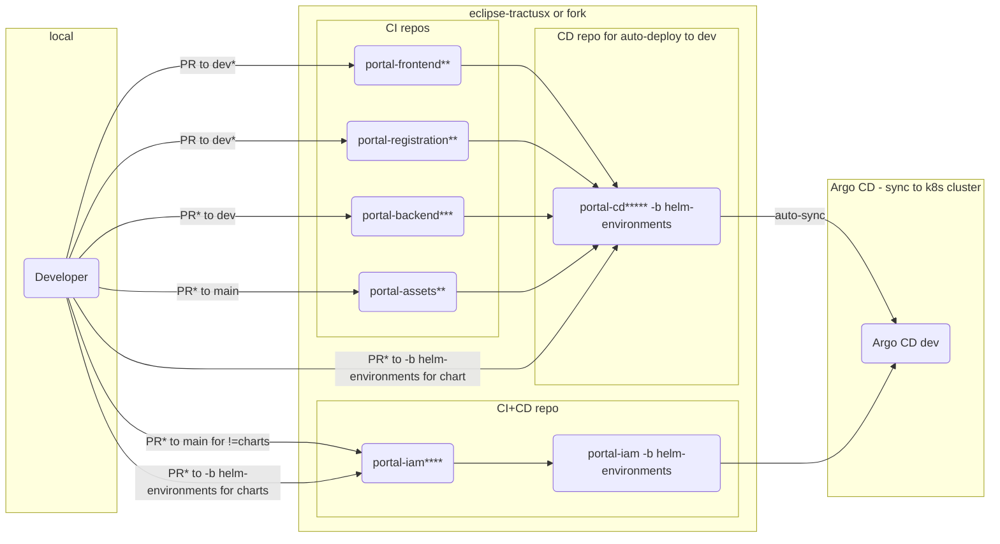

# Dev flow with deployment to dev environment

Note* Every pull request (PR) requires at least one approving review by a peer

Note** ESlint, unit tests and Sonarcloud runs at pull request, Trivy and KICS scans at merge as well as daily and Veracode scan runs weekly

Note*** Unit tests and Sonarcloud runs at pull request, Trivy and KICS scans at merge as well as daily and Veracode scan runs weekly

Note**** Sonarcloud runs at pull request, Trivy and KICS scans at merge as well as daily

Note***** Trivy and KICS scans are scheduled to daily
