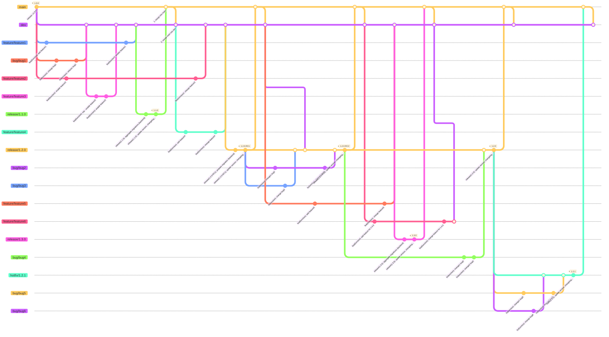

# Dev flow (git diagram)

## Notes for Migrations (Backend)

Migrations should be **aggregated in the case of releasing a new version**, in order to not release the entire history of migrations which accumulate during the development process.

Once a version has been released, migrations **mustn't be aggregated** in order to ensure upgradeability this also applies to **release candidates > RC1 and hotfixes**.
Be aware that migrations coming release branches for release candidates or from hotfix branches, will **need to be incorporated into dev and main**.
