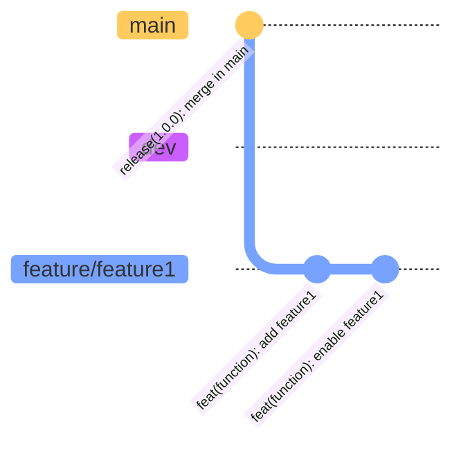
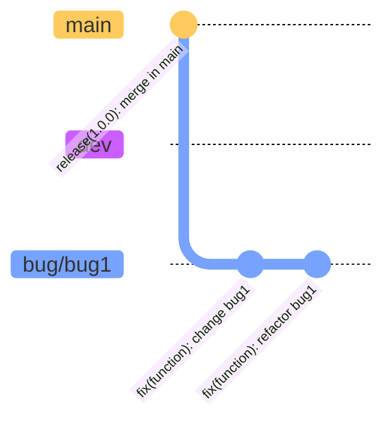
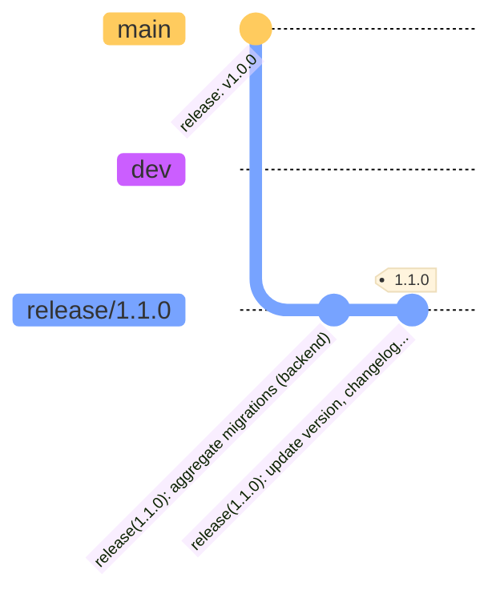
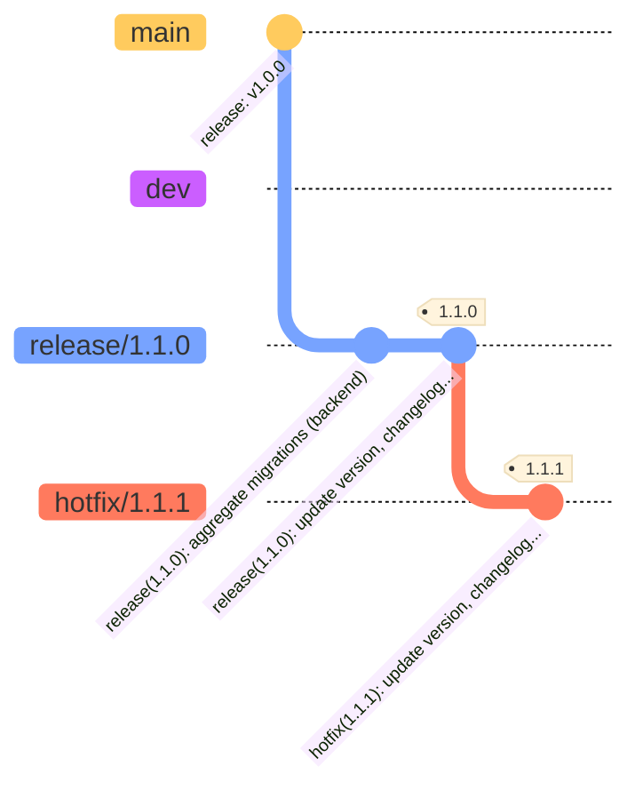

# Contribution details

To contribute to the portal as part of the open source community, please read the details defined below.
Besides a generic "how to", some commit and pull request (PR) guidelines are defined to ensure readability and make newly created PRs easier to review. Additionally, changelogs can get validated as well as written with more ease. Moreover, similar patterns are in use across the contributor community.

**Content**:

- [Commit How To](#how-to-contribute)
- [Commit and PR guidelines](#commit-and-pr-guidelines)

## How To Contribute

### 1 Create a fork

Open github - "eclipse-tractusx" project and select the respective repository to which you want to contribute.
[Create a fork of the respective repo](https://docs.github.com/en/get-started/quickstart/fork-a-repo).

### 2 Fork setup

Setup your fork by entering a name and make sure that you unselect the "main branch only" selection, in case the original repository has a dev and a main branch.

Click "Create fork"

### 3 Commit

With the newly created fork, you can now start to contribute. Create a new branch in your own fork and start to implement the planned changes or new features.
When the implementation is ready, create a PR against the original repository.

The PR will get reviewed by the repository owners/official committers.
As part of the pr review, sonarcloud will run automatically, and unit tests (if configured) will get executed. The PR owner is responsible to check the results and fix possible findings.

## Commit and PR guidelines

### Commits

The suggestion is to use [Conventional Commits](https://www.conventionalcommits.org/en/v1.0.0/).

Here are some examples

Feature branch:

Bugfix branch:

Release branch:

Hotfix branch:

### PR title

The suggested naming convention is '{type}{(function)}: {short summary}'

### PR description

Add details to the change, fix or feature in the PR description.
What was changed, why was it changed (e.g. which issue was fixed or which requirement was implemented), and how was it changed.
