## Summary

 
 

## Unit Tests

Unit tests are available for backend and frontend components and getting automatically executed as part of the code commits inside the CX NG.

 
 

## Test Automation

Information about the automation of functional e2e tests can be found under [Automation](./Automation).

 
 

## Manual Tests

Manual tests are executed and documented inside the Catena-X consortia. Currently, manual tests are not openly available.

 
 

## Penetration Tests

The lasted Penetration Test was performed on version 1.6.0-RC1 by an external security testing company and took place during the period of July-August 2023.

The following overview shows the open findings at the time of the release of version 1.7.0:

```mermaid
gantt
    title Findings Portal Backend
    dateFormat X
    axisFormat %s

    section Critical
    0   : 0, 0
    section High
    0   : 0, 0
    section Medium
    2   : 0, 2
    section Low
    5   : 0, 5

```

```mermaid
gantt
    title Findings Portal Frontend
    dateFormat X
    axisFormat %s

    section Critical
    0   : 0, 0
    section High
    0   : 0, 0
    section Medium
    2   : 0, 2
    section Low
    5   : 0, 5

```

As outlined in the [Security Policy](../../../SECURITY.md), the findings are documented as security advisories.

 
 

## NOTICE

This work is licensed under the [Apache-2.0](https://www.apache.org/licenses/LICENSE-2.0).

- SPDX-License-Identifier: Apache-2.0
- SPDX-FileCopyrightText: 2021-2023 Contributors to the Eclipse Foundation
- Source URL: https://github.com/eclipse-tractusx/portal-assets
