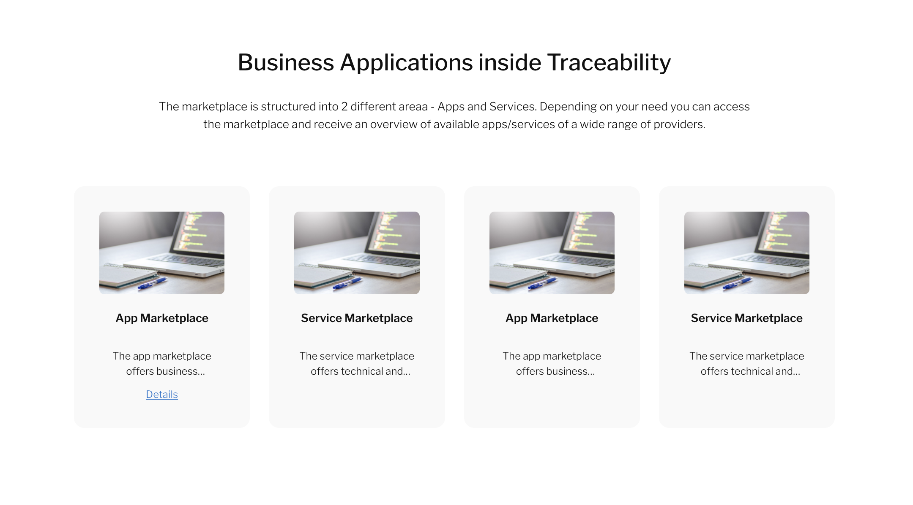
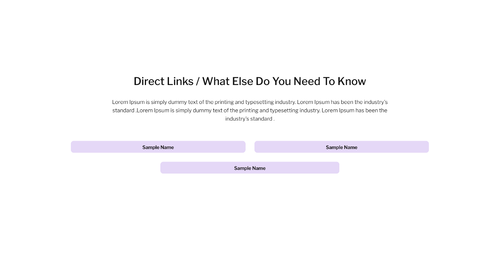
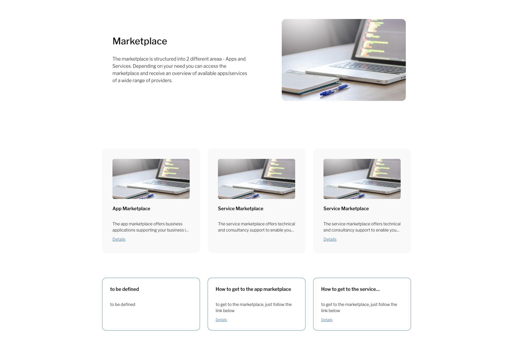
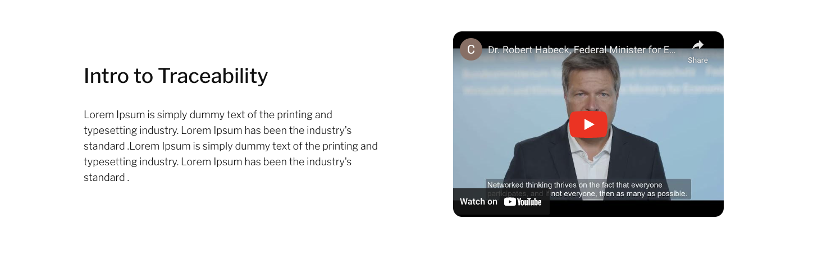
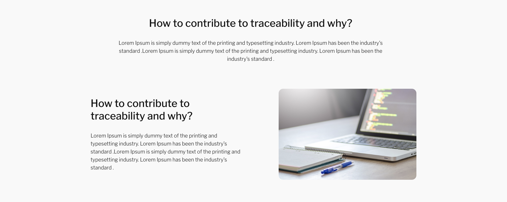
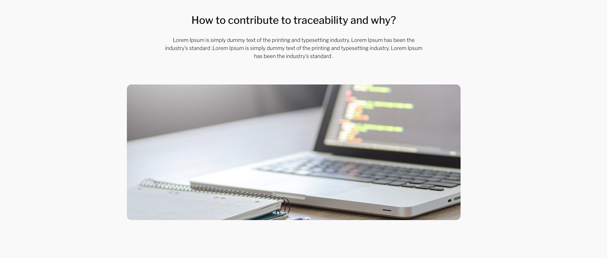
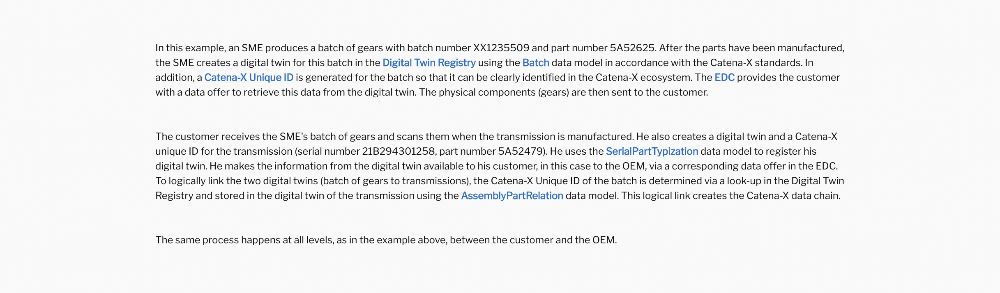
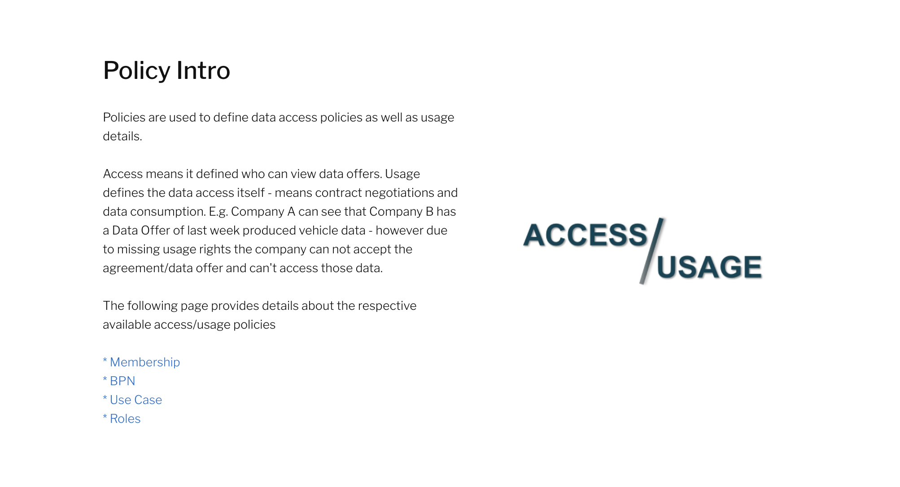
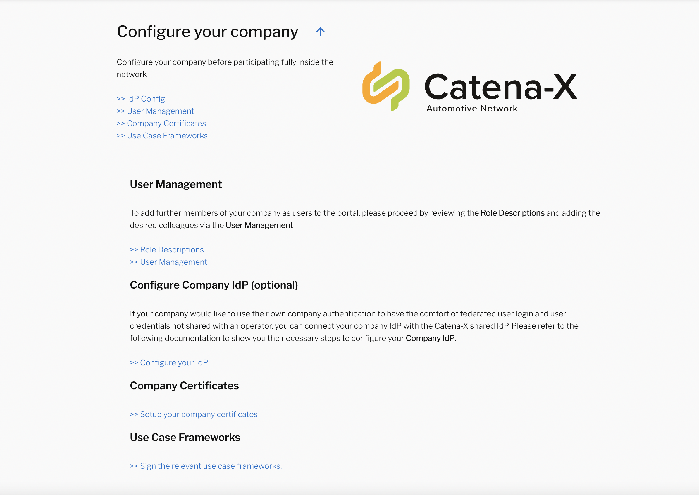

## Static Page Template(s)

The static page templates enable the users to build responsive static sites within extremly short time and in line with the CX styling guidelines.
Below you can find an overview of all supported templates as well as the template structure.

### Templates

#### Common Notes

* <id: `templateId`>
  * The `templateId` is the link in the sub navigation section.
  * The `templateId` has to be unique among the templates

#### #1 TextCenterAlignedWithCardGrid

Template Name: "TextCenterAlignedWithCardGrid"
 

 

  
Structure Details

  
      {
          title: 'Section Title',
          description:
            'description such as an introduction or explaination / subscription of the following cards - description such as an introduction or explanation / subscription of the following cards - description such as an introduction or explanation / subscription of the following cards - description such as an introduction or explanation / subscription of the following cards - description such as an introduction or explanation / subscription of the following cards',
          backgroundColor: '#FFFFFF',
          id: 'business-id',
          imageUrl:
            'https://cdn.pixabay.com/photo/2017/09/05/10/20/business-2717066_1280.jpg',
          grid: 4,
          template: 'TextCenterAlignedWithCardGrid',
          detailsWithImageRow1: [
            {
              title: 'Card Title 1',
              imageUrl:
                'https://cdn.pixabay.com/photo/2017/09/05/10/20/business-2717066_1280.jpg',
              description:
                'Card element description, with limited size.',
              readMore: '/appmarketplace',
              readMoreTitle: 'Details',
              backgroundColor: '#f9f9f9',
              align: 'center',
            },
            {
              title: 'Card Title 2',
              imageUrl:
                'https://cdn.pixabay.com/photo/2017/09/05/10/20/business-2717066_1280.jpg',
              description:
                'Card element description, with limited size.',
              readMore: '',
              backgroundColor: '#f9f9f9',
              align: 'center',
            },
            {
              title: 'Card Title 3',
              imageUrl:
                'https://cdn.pixabay.com/photo/2017/09/05/10/20/business-2717066_1280.jpg',
              description:
                'Card element description, with limited size.',
              readMore: '',
              backgroundColor: '#f9f9f9',
              align: 'center',
            },
            {
              title: 'Card Title 4',
              imageUrl:
                'https://cdn.pixabay.com/photo/2017/09/05/10/20/business-2717066_1280.jpg',
              description:
                'Card element description, with limited size.',
              readMore: '',
              backgroundColor: '#f9f9f9',
              align: 'center',
            },
          ],
        }
  
 

 
  
  

#### #2 TextCenterAlignedWithLinkButtonGrid  

Template Name: "TextCenterAlignedWithLinkButtonGrid"
 

 

   
Structure Details

        {
        title: 'Direct Links / What Else Do You Need To Know',
        description:
          "Lorem Ipsum is simply dummy text of the printing and typesetting industry. Lorem Ipsum has been the industry's standard .Lorem Ipsum is simply dummy text of the printing and typesetting industry. Lorem Ipsum has been the industry's standard .",
        imageUrl:
          'https://cdn.pixabay.com/photo/2017/09/05/10/20/business-2717066_1280.jpg',
        backgroundColor: '#FFFFFF',
        grid: 2,
        id: 'section-one',
        template: 'TextCenterAlignedWithLinkButtonGrid',
        linksRow1: [
          {
            background: '#C498EF63',
            title: 'Sample Name',
            navigate: '/appmanagement',
          },
          {
            background: '#C498EF63',
            title: 'Sample Name',
            navigate: '/appmanagement',
          },
          ],
        linksRow2: [
          {
            background: '#C498EF63',
            title: 'Sample Name',
            navigate: '/appmanagement',
          },
         ],
        }

  

 
 
 

#### #3 TextImageSideBySideWithCardGrid 

Template Name: "TextImageSideBySideWithCardGrid"
 

  
Structure Details

  
         {
      title: 'Section Title',
      description:
        'description such as an introduction or explaination / subscription of the following cards - description such as an introduction or explanation / subscription of the following cards - description such as an introduction or explanation / subscription of the following cards - description such as an introduction or explanation / subscription of the following cards - description such as an introduction or explanation / subscription of the following cards',
      imageUrl:
        'https://cdn.pixabay.com/photo/2017/09/05/10/20/business-2717066_1280.jpg',
      backgroundColor: '#FFFFFF',
      id: 'provider-id',
      template: 'TextImageSideBySideWithCardGrid',
      detailsWithImageRow1: [
        {
          title: 'Card Title 1',
          imageUrl:
            'https://cdn.pixabay.com/photo/2017/09/05/10/20/business-2717066_1280.jpg',
          description:
            'description such as an introduction or explaination / subscription of the following cards - description such as an introduction or explanation / subscription of the following cards - description such as an introduction or explanation / subscription of the following cards - description such as an introduction or explanation / subscription of the following cards - description such as an introduction or explanation / subscription of the following cards',
          readMore: '/help',
          readMoreTitle: 'Details',
          backgroundColor: '#F9F9F9',
        },
        {
          title: 'Card Title 2',
          imageUrl:
            'https://cdn.pixabay.com/photo/2017/09/05/10/20/business-2717066_1280.jpg',
          description:
            'description such as an introduction or explaination / subscription of the following cards - description such as an introduction or explanation / subscription of the following cards - description such as an introduction or explanation / subscription of the following cards - description such as an introduction or explanation / subscription of the following cards - description such as an introduction or explanation / subscription of the following cards',
          readMore: '/help',
          backgroundColor: '#F9F9F9',
        },
        {
          title: 'Card Title 3',
          imageUrl:
            'https://cdn.pixabay.com/photo/2017/09/05/10/20/business-2717066_1280.jpg',
          description:
            'description such as an introduction or explaination / subscription of the following cards - description such as an introduction or explanation / subscription of the following cards - description such as an introduction or explanation / subscription of the following cards - description such as an introduction or explanation / subscription of the following cards - description such as an introduction or explanation / subscription of the following cards',
          readMore: '/help',
          readMoreTitle: 'Details',
          backgroundColor: '#F9F9F9',
        },
      ],
      detailsWithoutImageRow1: [
        {
          title: 'Card Title 1',
          description: 'Card element description, with limited size.',
          readMore: '',
          readMoreTitle: 'Details',
          backgroundColor: '#FFFFFF',
        },
        {
          title: 'Card Title 2',
          description: 'Card element description, with limited size.',
          readMore: '',
          readMoreTitle: 'Details',
          backgroundColor: '#FFFFFF',
        },
        {
          title: 'Card Title 3',
          description: 'Card element description, with limited size.',
          readMore: '',
          readMoreTitle: 'Details',
          backgroundColor: '#FFFFFF',
        },
       ],
      }
  

 
 
 

#### #4 TextVideoSideBySide 

Template Name: "TextVideoSideBySide"
 

  
Structure Details

  
    {
      title: 'Intro headline',
      description:
        "Lorem Ipsum is simply dummy text of the printing and typesetting industry. Lorem Ipsum has been the industry's standard .Lorem Ipsum is simply dummy text of the printing and typesetting industry. Lorem Ipsum has been the industry's standard .",
      videoUrl: 'https://www.youtube.com/embed/g-NVjP2srw4',
      id: 'intro-id',
      backgroundColor: '#FFFFFF',
      template: 'TextVideoSideBySide',
    },
  

 
 
 

#### #5 Video-Text-Side-By-Side 

Template Name: "VideoTextSideBySide"
 

  
Structure Details

  
    {
      title: 'Intro headline',
      description:
        "Lorem Ipsum is simply dummy text of the printing and typesetting industry. Lorem Ipsum has been the industry's standard .Lorem Ipsum is simply dummy text of the printing and typesetting industry. Lorem Ipsum has been the industry's standard .",
      videoUrl: 'https://www.youtube.com/embed/g-NVjP2srw4',
      id: 'intro-id',
      backgroundColor: '#FFFFFF',
      template: 'VideoTextSideBySide',
    },
  

 
 
 
 
#### #6 Text-Image-Center-Aligned

Template Name: "TextImageCenterAligned"
 

  
Structure Details

  
    {
      title: 'How to contribute to traceability and why?',
      description:
        "Lorem Ipsum is simply dummy text of the printing and typesetting industry. Lorem Ipsum has been the industry's standard .Lorem Ipsum is simply dummy text of the printing and typesetting industry. Lorem Ipsum has been the industry's standard .",
      imageUrl:
        'https://cdn.pixabay.com/photo/2017/09/05/10/20/business-2717066_1280.jpg',
      backgroundColor: '#F9F9F9',
      id: 'data-id',
      template: 'TextImageCenterAligned',
    },
  

 
 
 

#### #7 Text-Center-Aligned

Template Name: "TextCenterAligned"
 

  
Structure Details

  
    {
      title: 'How to contribute to traceability and why?',
      description:
        "Lorem Ipsum is simply dummy text of the printing and typesetting industry. Lorem Ipsum has been the industry's standard .Lorem Ipsum is simply dummy text of the printing and typesetting industry. Lorem Ipsum has been the industry's standard .",
      backgroundColor: '#F9F9F9',
      id: 'data1-id',
      template: 'TextCenterAligned',
    },
  

 
 

#### #8 Text-Image-Side-By-Side

Template Name: "TextImageSideBySide"
 

  
Structure Details

  
    {
      title: 'How to contribute to traceability and why?',
      description:
        "Lorem Ipsum is simply dummy text of the printing and typesetting industry. Lorem Ipsum has been the industry's standard .Lorem Ipsum is simply dummy text of the printing and typesetting industry. Lorem Ipsum has been the industry's standard .",
      imageUrl:
        'https://cdn.pixabay.com/photo/2017/09/05/10/20/business-2717066_1280.jpg',
      backgroundColor: '#F9F9F9',
      id: 'data2-id',
      template: 'TextImageSideBySide',
    },
  

 
 

#### #9 TextCenterAlignedBody2

Template Name: "TextCenterAlignedBody2"
 

 

  
Structure Details

      {
        title '',
        subTitles [
          'In this example, an SME produces a batch of gears with batch number XX1235509 and part number 5A52625. After the parts have been manufactured, the SME creates a digital twin for this batch in the <strong class='tooltip'>Digital Twin Registry<0>Each traceable object is mapped via a digital twin and registered in the Digital Twin Registry</0></strong> using the <strong class='tooltip'>Batch<0>Represents the master data of a batch after the assembly process. Relevant for manufacturers of components with large batches, which are produced under the same manufacturing conditions and bundled in a batch number.</0></strong> data model in accordance with the Catena-X standards. In addition, a <strong class='tooltip'>Catena-X Unique ID<0>Catena-X ID - Universally Unique Identifier (UUID): Each object (raw material, component or vehicle) receives a unique Catena-X ID for an unequivocally identification in the Catena-X data room.</0></strong> is generated for the batch so that it can be clearly identified in the Catena-X ecosystem. The <strong class='tooltip'>EDC<0>The Eclipse Dataspace Connector (EDC) is the standard connector within the Catena-X network that ensures secure and sovereign data exchange.</0></strong> provides the customer with a data offer to retrieve this data from the digital twin. The physical components (gears) are then sent to the customer.<1></1><1></1><1></1>',
          'The customer receives the SME's batch of gears and scans them when the transmission is manufactured. He also creates a digital twin and a Catena-X unique ID for the transmission (serial number 21B294301258, part number 5A52479). He uses the <strong class='tooltip'>SerialPartTypization<0>Represents the master data of a component with its own serial number after the assembly process. Relevant for manufacturers of serialized individual parts or vehicle manufacturers.</0></strong> data model to register his digital twin. He makes the information from the digital twin available to his customer, in this case to the OEM, via a corresponding data offer in the EDC. To logically link the two digital twins (batch of gears to transmissions), the Catena-X Unique ID of the batch is determined via a look-up in the Digital Twin Registry and stored in the digital twin of the transmission using the <strong class='tooltip'>AssemblyPartRelation<0>Represents the relationship between the components after the assembly process. For example, which batch (gear wheel, raw material) is installed in which serialized part (transmission) in which vehicle.</0></strong> data model. This logical link creates the Catena-X data chain.<1></1><1></1><1></1>',
          'The same process happens at all levels, as in the example above, between the customer and the OEM.<1></1><1></1><1></1>'
          ],
        id 'details3-id',
        backgroundColor '#f9f9f9',
        template 'TextCenterAlignedBody2'
      }

 

  
  

#### #10 TextImageSideBySideWithLinks

Template Name: "TextImageSideBySideWithLinks"
 

 

  
Structure Details

      {
        title:"Policy Intro",
        description:"Policies are used to define data access policies as well as usage details.<1></1><1></1>Access means it defined who can view data offers. Usage defines the data access itself - means contract negotiations and data consumption. E.g. Company A can see that Company B has a Data Offer of last week produced vehicle data - however due to missing usage rights the company can not accept the agreement/data offer and can't access those data.<1></1><1></1>The following page provides details about the respective available access/usage policies<1></1><1></1>",
        imagePath:"/images/frame/AccessVsUsage.png",
        backgroundColor:"#FFFFFFF",
        id:"core-id",
        template:"TextImageSideBySide",
        sectionLink: {
          data: [
            {
              title: "* Membership",
              id:"membership-id",
              internal: true
            },
            {
              title: "* BPN",
              id:"bpn-id",
              internal: true
            },
            {
              title: "* Use Case",
              id:"usecase-id",
              internal: true
            },
            {
              title: "* Roles",
              id:"roles-id",
              internal: true
            }
          ]
        }
      }

 

  
  

#### #11 TextImageSideBySideWithSections

Template Name: "TextImageSideBySideWithSections"
 

 

  
Structure Details

      {
        title: "Configure your company",
        description: "Configure your company before participating fully inside the network<1></1><1></1>",
        imagePath: "/images/logos/cx-text.svg",
        backgroundColor: "#F9F9F9",
        id: "company-setting-id",
        template: "TextImageSideBySideWithSections",
        sectionLink: {
          data: [
            {
              title: ">> IdP Config",
              id: idp-id",
              internal: true
            },
            {
              title: ">> User Management",
              id: "user-id",
              internal: true
            },
            {
              title: ">> Company Certificates",
              id: "company-id",
              internal: true
            },
            {
              title: ">> Use Case Frameworks",
              id: "usecase-id",
              internal: true
            }
          ]
        },
        subsections: [
          {
            title: "User Management",
            description:
              "To add further members of your company as users to the portal, please proceed by reviewing the <strong>Role Descriptions</strong> and adding the desired colleagues via the <strong>User Management</strong><1></1><1></1>",
            id: "user-id",
            sectionLink: {
              data: [
                {
                  title: ">> Role Descriptions",
                  id: "/role-details",
                  internal: false
                },
                {
                  title: ">> User Management",
                  id: "/usermanagement",
                  internal: false
                }
              ]
            }
          },
          {
            title: "Configure Company IdP (optional)",
            description:
              "If your company would like to use their own company authentication to have the comfort of federated user login and user credentials not shared with an operator, you can connect your company IdP with the Catena-X shared IdP. Please refer to the following documentation to show you the necessary steps to configure your <strong>Company IdP</strong>.<1></1><1></1>",
            id: idp-id",
            sectionLink: {
              data: [
                {
                  title: ">> Configure your IdP",
                  id: "/documentation/?path=docs%2F02.+Technical+Integration%2F02.+Identity+Provider+Management",
                  internal: false
                }
              ]
            }
          },
          {
            title: "Company Certificates",
            description: "",
            id: "company-id",
            sectionLink: {
              data: [
                {
                  title: ">> Setup your company certificates",
                  id: "/documentation/?path=docs%2F06.+Certificates%2F02.+Other+Certificates.md",
                  internal: false
                }
              ]
            }
          },
          {
            title: "Use Case Frameworks",
            description: "",
            id: "usecase-id",
            sectionLink: {
              data: [
                {
                  title: ">> Sign the relevant use case frameworks.",
                  id: "/documentation/?path=docs%2F06.+Certificates%2F01.+UseCase+Participation.md",
                  internal: false
                }
              ]
            }
          }
        ]
      }

 

  
  

### Implementation  

To create a new page or enhance an existing page, the following steps need to get performed
 

#### New Page creation
If a complete new page with the usage static data templates is planned, the page need to get introduced inside the portal frontend repo as well as inside the asset repo.
The frontend repo is needed to introduce the page, permissions to the page as well as the navigation.

 
 

#### Enhancing an existing page
For enhancing an existing page, the asset files insidide the asset repo => /public/assets/content/de/.... need to get enhanced.
Please ensure that you extend all language files and not only one.

By adding a new template (as mentioned above) inside the content files, the portal page will get automatically extended by the new content.

 
 

