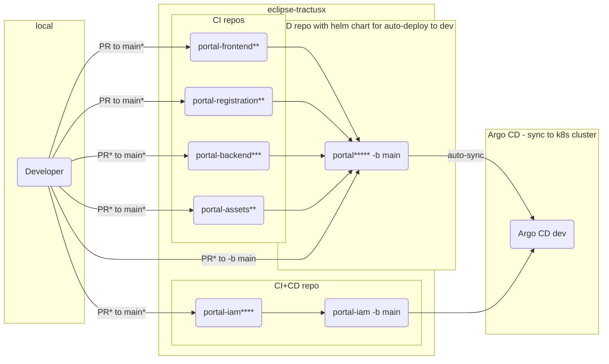

# Dev flow with deployment to dev environment

Note\* Every pull request (PR) requires at least one approving review by a committer

Note\*\* ESlint, unit tests, Sonarcloud, CodeQL checks run at pull request, Trivy and KICS scans run at push on main as well as daily

Note\*\*\* Unit tests and Sonarcloud, CodeQL checks run at pull request, Trivy and KICS scans run at push on main as well as daily

Note\*\*\*\* Sonarcloud runs at pull request, Trivy and KICS scans run at push on main as well as daily

Note**\*** Trivy and KICS scans run at push on main as well as daily

## NOTICE

This work is licensed under the [Apache-2.0](https://www.apache.org/licenses/LICENSE-2.0).

- SPDX-License-Identifier: Apache-2.0
- SPDX-FileCopyrightText: 2023 Contributors to the Eclipse Foundation
- Source URL: https://github.com/eclipse-tractusx/portal-assets
