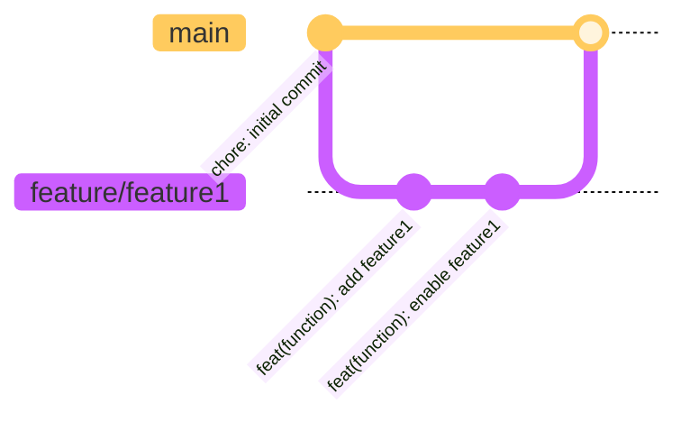
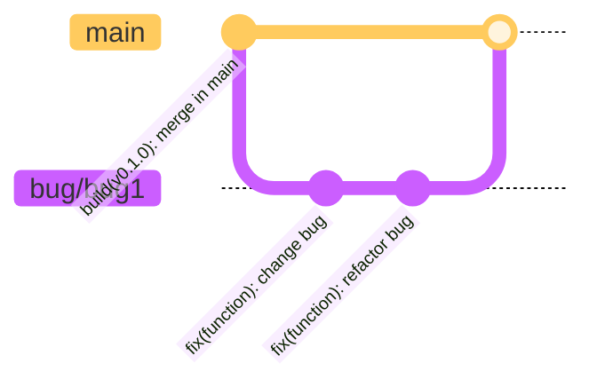
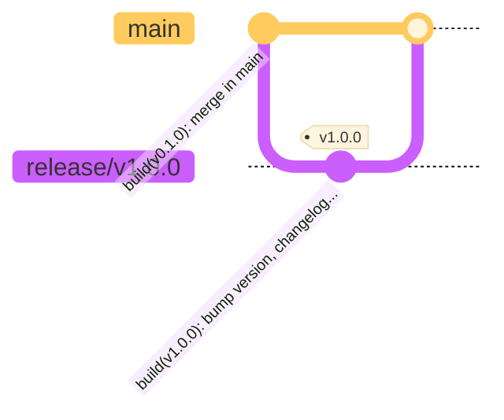
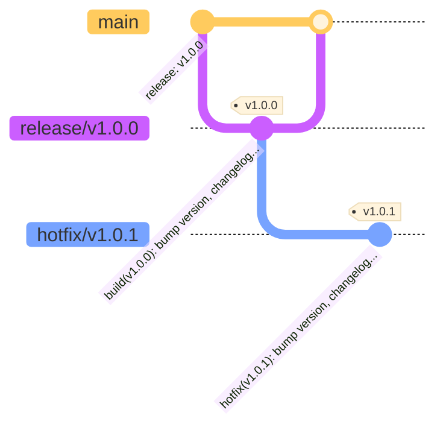

# Contribution details

To contribute to the Portal as part of the open source community, please read the details defined below.
Besides a generic "how to", some commit and pull request (PR) guidelines are defined to ensure readability and make newly created PRs easier to review. Additionally, changelogs can get validated as well as written with more ease. Moreover, similar patterns are in use across the contributor community.

**Content**:

- [Commit How To](#how-to-contribute)
- [Commits, branches and pull requests guidelines](#commits-branches-and-pull-requests-guidelines)

## How To Contribute

### 1 Create a fork

Open [GitHub - "eclipse-tractusx" project](https://github.com/eclipse-tractusx) and select the respective repository to which you want to contribute.
[Create a fork of the respective repo](https://docs.github.com/en/get-started/quickstart/fork-a-repo).

### 2 Fork setup

Setup your fork by entering a name and make sure that you unselect the "main branch only" selection, in case the upstream repository maintains release branches besides the main branch.

Click "Create fork".

### 3 Commit

With the newly created fork, you can now start to contribute. Create a new branch in your own fork and start to implement the planned changes or new features.
When the implementation is ready, create a PR against the upstream repository.

The PR will get reviewed by the repository owners/official committers.
As part of the PR review, checks will run automatically, and unit tests (if configured) will get executed. The PR owner is responsible to check the results and fix possible findings.

## Commits, branches and pull requests guidelines

### Commits and branches

The suggestion is to use [Conventional Commits](https://www.conventionalcommits.org/en/v1.0.0/).

Here are some examples:

#### Feature branch

#### Bugfix branch

#### Release branch

#### Hotfix branch

### PR title

The suggested naming convention is '{type}{(function)}: {short summary}'.

### PR description

Add details to the change, fix or feature in the PR description.
What was changed, why was it changed (e.g. which issue was fixed or which requirement was implemented), and how was it changed.

### Adding Pictures

If your change includes adding pictures, please add them in the following way:

1. Add the picture to the docs/static folder if it is documentation app specific or to public/assets/images for portal app specific pictures.
2. Generate a license file for your picture either manually or by using the scripts\license.sh. Please make sure that the license file states the correct information in term of legal obligations especially in the case of [3rd party content](https://eclipse-tractusx.github.io/docs/release/trg-7/trg-7-04). Also, please don't change any information in already existing license files.
3. [Only relevant for docs/static pictures] Link to your picture from the static folder like this https://raw.githubusercontent.com/eclipse-tractusx/portal-assets/main/docs/static/YOUR_FILE.png

The absolute path in step 3 is necessary because the documentation app is not yet enabled for relative paths: [#236](https://github.com/eclipse-tractusx/portal-assets/issues/236).

### Additional information

Please refer to the [Development Flow](./Dev-flow_git-diagram.md).

## NOTICE

This work is licensed under the [Apache-2.0](https://www.apache.org/licenses/LICENSE-2.0).

- SPDX-License-Identifier: Apache-2.0
- SPDX-FileCopyrightText: 2023 Contributors to the Eclipse Foundation
- Source URL: https://github.com/eclipse-tractusx/portal-assets
