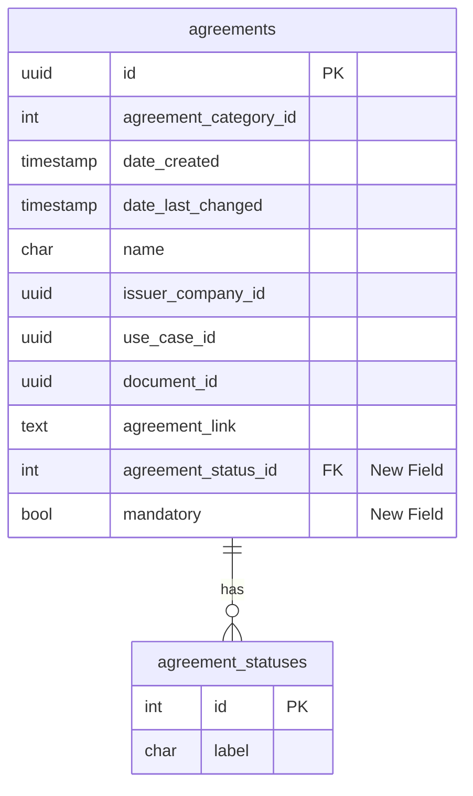
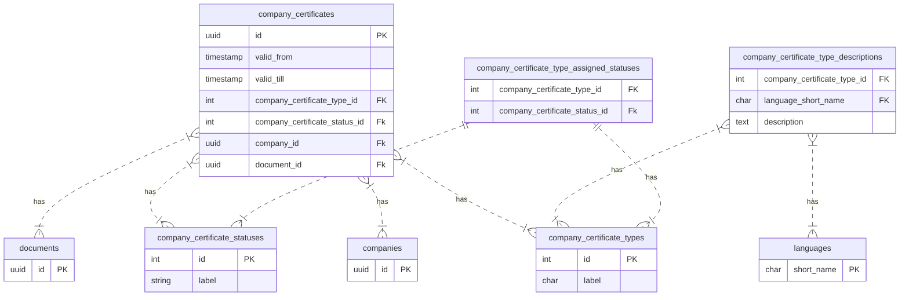

- [Summary](#summary)
  - [v2.5.0-RC1](#v250-rc1)
    - [Enhance Provider Company Details](#enhance-provider-company-details)
  - [v2.4.0](#v240)
    - [Add New Process Step Types](#add-new-process-step-types)
    - [Sd Skipped Date](#sd-skipped-date)
    - [Tagus clearing house changes](#tagus-clearing-house-changes)
    - [Provider Owned Technical User](#provider-owned-technical-user)
    - [Translatable Agreement Descriptions](#translatable-agreement-descriptions)
    - [Document Size](#document-size)
    - [Decline Offer Subscription](#decline-offer-subscription)
  - [v2.3.0](#v230)
    - [Service Account renaming](#service-account-renaming)
    - [BPDM Access Configuration adjustment](#bpdm-access-configuration-adjustment)
    - [Offer Provider](#offer-provider)
    - [Company Invitations](#company-invitations)
  - [v2.2.0](#v220)
    - [Add SelfDescription Creation Process](#add-selfdescription-creation-process)
    - [Enhance Certificate Management](#enhance-certificate-management)
  - [v2.1.0](#v210)
    - [Removal of company credentials](#removal-of-company-credentials)
  - [v2.0.0](#v200)
    - [OnboardingServiceProvider - ENHANCED](#onboardingserviceprovider---enhanced)
    - [Postgres dependency of helm chart - ENHANCED](#postgres-dependency-of-helm-chart---enhanced)
  - [v1.8.0](#v180)
    - [Agreements - ENHANCED](#agreements---enhanced)
      - [Impact on existing data:](#impact-on-existing-data)
    - [Company Certificate Details - NEW](#company-certificate-details---new)
      - [Company Certificate Database Structure](#company-certificate-database-structure)
        - [Supported company_certificate_statuses:](#supported-company_certificate_statuses)
        - [Supported company_certificate_type_statuses:](#supported-company_certificate_type_statuses)
        - [Supported company_certificate_types:](#supported-company_certificate_types)
  - [v1.7.0](#v170)
    - [PostgreSQL - Upgrade](#postgresql---upgrade)
    - [Company Service Account - FIX](#company-service-account---fix)
    - [Enable OSP Provider IdPs - Update](#enable-osp-provider-idps---update)
    - [Enable Application Types - NEW](#enable-application-types---new)
    - [Enable Onboarding Service Provider - NEW](#enable-onboarding-service-provider---new)
    - [Technical Role - UPDATE](#technical-role---update)
    - [Database Constraints - FIX](#database-constraints---fix)
    - [Technical User Profile - CHANGE](#technical-user-profile---change)
  - [v1.6.0](#v160)
    - [Company Credential Details - NEW](#company-credential-details---new)
    - [Connectors - CHANGED](#connectors---changed)
  - [v1.4.0](#v140)
    - [Technical User Profiles - NEW](#technical-user-profiles---new)
    - [License Types - NEW \& ENHANCED](#license-types---new--enhanced)
  - [v1.2.0](#v120)
    - [Mediatype - NEW \& ENHANCED](#mediatype---new--enhanced)
  - [v1.1.0](#v110)
    - [Application Checklist - ENHANCED](#application-checklist---enhanced)
    - [Service Details - NEW (interim)](#service-details---new-interim)
- [NOTICE](#notice)

## Summary

This document describes the portal database changes and its impact on transactional data. Depending on the impact, possible risks/impediments on upgrades as well as mitigation plans are described.
Each section includes the respective change details, impact on existing data and the respective release with which the change is getting active.

> **_INFO:_** inside the detailed descriptions below, the definition 'migration script' refers to the term 'migrations' as it is defined by the ef-core framework: https://learn.microsoft.com/en-us/ef/core/managing-schemas/migrations

### v2.5.0-RC1

#### Enhance Provider Company Details

- ENHANCE: table `provider_company_details` add new columns `auth_url`, `client_id`, `client_secret`, `encryption_mode`, `initialization_vector`
- NEW: add new auditing table `audit_provider_company_detail20241210`

The auto setup callback process was enhanced to post the result of the auto setup to the provider with specific technical users. These information have been added to the `provider_company_details` table.

### v2.4.0

#### Add New Process Step Types

- ENHANCE: table `process_step_types` add entries `SET_CX_MEMBERSHIP_IN_BPDM` & `RETRIGGER_SET_CX_MEMBERSHIP_IN_BPDM`

The new process step types were added to support the new membership call to the bpdm which is made in the company onboarding.

#### Sd Skipped Date

- ENHANCE: table `connectors` add column `sd_skipped_date`

Column `sd_skipped_date` was added to get information about when a sd document creation of for a connector was skipped if the `clearinghouseDisabled` flag is set to true.

#### Tagus clearing house changes

- ENHANCE: table `addresses` modified column `region` as NOT-NULLABLE

`region` field has been mandatory at clearing house level so that's why its NOT-NULLABLE at portal end as well.

With new clearing house version, all legal person and connector self description documents are no longer accepted by clearing house for validation.

To prevent interruptions of connector creation, the system will notice outdated documents and activate connectors and mark document creation as skipped.

Automatic reissuance is not supported yet. The operator has to generate new versions of all previously issued documents to create fully compatible companies.

Following endpoints have previously been implemented to retrigger issuance of missing documents:
`/api/administration/companydata/retrigger-self-description`
`/api/administration/Connectors/retrigger-self-description`
They were not intended for a proper reissuance processes. Caution is advised.

#### Provider Owned Technical User

- ENHANCE: table `technical_user_types` add `PROVIDER_OWNED`
- ENHANCE: adjust view `company_linked_technical_users`

The view `company_linked_technical_users` has been adjusted to include the provider owned technical users and set the provider as well as owner to the offer provider company.

#### Translatable Agreement Descriptions

- NEW: table `agreement_descriptions`

The `agreement_descriptions` got added to make the descriptions of agreements configurable for a specific language code which allows translatable descriptions.

#### Document Size

- ENHANCED: table `documents` column `document_size` was added

To have the size of the document without calculating it every time the document size has been added to the database.

#### Decline Offer Subscription

- ENHANCED: table `notification_type` add entries `APP_SUBSCRIPTION_DECLINE` & `SERVICE_SUBSCRIPTION_DECLINE`

To send the respective notification types on offer subscription declination.

### v2.3.0

#### Service Account renaming

All service account tables have been renamed to technical user. All changes are handled by the migration.
The explicit changes can be found [here](https://github.com/eclipse-tractusx/portal-backend/blob/v2.3.0-RC3/CHANGELOG.md#230-rc1)

#### BPDM Access Configuration adjustment

Instead of configuring the BPDM Access directly on root level a section got introduced.

**Old Configuration**

```json
    "BpnAccess": "https://example.org"
```

**New Configuration**

```json
  "BpnAccess": {
     "BaseAddress": "https://example.org"
  }
```

#### Offer Provider

- REMOVED: table `offers` column `provider` was removed

Instead of the column provider the link of the provider_company_id is used to get the name of the providing company.

#### Company Invitations

REMOVED: table `company_invitations` column `organisation_name` was removed
ENHANCED: table `company_invitations` column `application_id` was made non nullable

The organisation name was removed from the table, instead of the organisation name the name of the company is taken via the link of the company application

### v2.2.0

#### Add SelfDescription Creation Process

- ENHANCED: table `companies` column `sd_creation_process_id` was added
- ENHANCED: table `connectors` column `sd_creation_process_id` was added

The columns `sd_creation_process_id` were added to the tables to link the newly introduced sd creation process to the company and connector.

#### Enhance Certificate Management

- ENHANCED: table `companies_certificate` columns `external_certificate_number`, `issuer`, `trust_level`, `validator` were added
- ENHANCED: table `companies_certificate` column `valid_from` is now nullable
- NEW: table `company_certificate_assigned_sites` added

New table company_certificate_assigned_sites was added to assign certificates to bpns.

### v2.1.0

#### Removal of company credentials

- REMOVED: tables `company_ssi_details`, `verified_credential_type_assigned_external_types`, `verified_credential_type_assigned_kinds`, `verified_credential_type_assigned_use_cases`, `company_ssi_detail_statuses`, `verified_credential_external_type_use_case_detail_versions`, `verified_credential_type_kinds`, `verified_credential_types`, `verified_credential_external_types` were removed from the portal database and moved to the [ssi-credential-issuer](https://github.com/eclipse-tractusx/ssi-credential-issuer)

### v2.0.0

#### OnboardingServiceProvider - ENHANCED

- ENHANCED: table onboarding_service_provider_details "encryption_mode" added
- ENHANCED: table onboarding_service_provider_details "initialization_vector" added

- ENHANCED: configuration for onboarding-service-provider:

```
    "OnboardingServiceProvider": {
      "EncryptionConfigIndex": 1,
      "EncryptionConfigs": [
        {
          "Index": 0,
          "EncryptionKey": "",
          "CipherMode": "",
          "PaddingMode": ""
        },
        {
          "Index": 1,
          "EncryptionKey": "",
          "CipherMode": "",
          "PaddingMode": ""
        }
      ]
    }
```

Previous OnboardingServiceProvider settings contained 'EncryptionKey'. Format was utf8-string being read as byte[].
New format of EncryptionKey is 64 characters hex

Example:

- old format:

```
    "OnboardingServiceProvider": {
      "EncryptionKey": ")U\;>/h=ELj+.v5AD9(P2HQ3JnuYt.R:"
    }
```

- including the details that before the change were defined in the source code the same configuration as 'index 0' in new format:

```
    "OnboardingServiceProvider": {
      "EncryptionConfigIndex": 1,
      "EncryptionConfigs": [
        {
          "Index": 0,
          "EncryptionKey": "29555c3b3e2f683d454c6a2b2e76354144392850324851334a6e7559742e523a",
          "CipherMode": "ECB",
          "PaddingMode": "PKCS7"
        },
        {
          "Index": 1,
          "EncryptionKey": "deadbeefdeadbeefdeadbeefdeadbeefdeadbeefdeadbeefdeadbeefdeadbeef",
          "CipherMode": "CBC",
          "PaddingMode": "PKCS7"
        }
      ]
    }
```

to ensure the new encryption is able to decrypt preexisting client_secrets the old encryption-key must be converted to the new format. This may be done on the command-line:

```
echo -n ")U\;>/h=ELj+.v5AD9(P2HQ3JnuYt.R:" | xxd -p
```

#### Postgres dependency of helm chart - ENHANCED

Be aware that the PostgreSQL version of the subchart by Bitnami of the [portal helm chart](https://github.com/eclipse-tractusx/portal) has been changed from 15.4.x to use the latest available version of 15.

In addition, the fullnameOverride, which was set by default, has been removed which leads to a differently named database server. In case you would like to upgrade the PostgreSQL subchart, the fullnameOverride can either be applied by overwrite using an additional values.yaml file or by executing a blue-green deployment, as outlined below: [PostgreSQL Dependency - Upgrade](#postgresql---upgrade)

### v1.8.0

#### Agreements - ENHANCED

- NEW: table portal.agreement_statuses
- ENHANCED: table portal.agreements "agreement_status_id" added
- ENHANCED: table portal.agreements "mandatory" added
- REMOVED: table portal.agreements "agreement_type" removed

New agreement_statuses table released to manage agreement status by supporting a new label ACTIVE/INACTIVE.

###### Impact on existing data:

As part of the migration, for all existing records inside the table portal.agreements the "mandatory" (true/false flag) is getting set with default value as `true` and "agreement_status_id" set with default value as `1` i.e. ACTIVE



#### Company Certificate Details - NEW

- NEW: portal.company_certificates
- NEW: portal.company_certificate_types
- NEW: portal.company_certificate_type_statuses
- NEW: portal.company_certificate_statuses
- NEW: portal.company_certificate_type_descriptions
- NEW: portal.company_certificate_type_assigned_statuses

New company_certificates table is used to store company certificates and their status  
New company_certificate_statuses table released managing supported certificate status values (supported types can get found below)
New company_certificate_types_statuses table released managing supported certificate type status values (supported types can get found below)  
New company_certificate_type table released managing supported certificate types (supported types can get found below)  
New company_certificate_type_descriptions table released managing certificate types description in multiple languages  
New company_certificate_type_assigned_statuses managing the status (Active/Inactive) for company certificate types

##### Company Certificate Database Structure



###### Supported company_certificate_statuses:

| license_type_id | license_type |
| --------------- | ------------ |
| 1               | ACTIVE       |
| 2               | INACTIVE     |

###### Supported company_certificate_type_statuses:

| license_type_id | license_type |
| --------------- | ------------ |
| 1               | ACTIVE       |
| 2               | INACTIVE     |

###### Supported company_certificate_types:

| license_type_id | license_type                                    |
| --------------- | ----------------------------------------------- |
| 1               | AEO_CTPAT_Security_Declaration                  |
| 2               | ISO_9001                                        |
| 3               | IATF_16949                                      |
| 4               | ISO_14001_EMAS_or_national_certification        |
| 5               | ISO_45001_OHSAS_18001_or_national_certification |
| 6               | ISO_IEC_27001                                   |
| 7               | ISO_50001_or_national_certification             |
| 8               | ISO_IEC_17025                                   |
| 9               | ISO_15504_SPICE                                 |
| 10              | B_BBEE_Certificate_of_South_Africa              |
| 11              | IATF                                            |
| 12              | TISAX                                           |

### v1.7.0

#### PostgreSQL - Upgrade

Please be aware that the PostgreSQL version of the subchart by Bitnami of the [portal helm chart](https://github.com/eclipse-tractusx/portal) is upgraded from 14.5.0 to 15.4.x (dependency updated from version 11.9.13 to 12.12.x).

In case you are using an external PostgreSQL instance and would like to upgrade to 15.x, please follow the [official instructions](https://www.postgresql.org/docs/user/15/upgrading.html).

In case you would like to upgrade the PostgreSQL subchart from Bitnami, we recommend a blue-green deployment approach. In the following, you find a rough outline of the necessary steps:

1. Scale down the current Portal services and suspend jobs (blue deployment)
2. Backup the current data
3. Deploy the new Portal instance (green deployment e.g: `-green`, `-portal170`, ...) in another namespace than the blue instance
4. Restore the data of the blue instance to the green instance
5. Start the new Portal services
6. Make sure that the database migrations jobs which are defined as post-upgrade hooks are completed successfully
7. Once the new/green instance is validated, switch the user traffic to it

For restoring the data of the blue instance to the green instance (step 4), execute the following statement using [pg-dumpall](https://www.postgresql.org/docs/user/current/app-pg-dumpall.html):

On the cluster:

```shell
 kubectl exec -it green-postgresql-primary-0 -n green-namespace -- /opt/bitnami/scripts/postgresql/entrypoint.sh /bin/bash -c 'export PGPASSWORD=""; echo "local all postgres trust" > /opt/bitnami/postgresql/conf/pg_hba.conf; pg_ctl reload; time pg_dumpall -c -h 10-123-45-67.blue-namespace.pod.cluster.local -U postgres | psql -U postgres'
```

Or on the primary pod of the new/green PostgreSQL instance:

```shell
/opt/bitnami/scripts/postgresql/entrypoint.sh /bin/bash -c 'export PGPASSWORD=""; echo "local all postgres trust" > /opt/bitnami/postgresql/conf/pg_hba.conf; pg_ctl reload; time pg_dumpall -c -h 10-123-45-67.blue-namespace.pod.cluster.local -U postgres | psql -U postgres'
```

Where '10-123-45-67' is the cluster IP of the old/blue PostgreSQL instance.

#### Company Service Account - FIX

To fix the empty user_entity_id for company_service_accounts the following process can be created. It will than run the process which will request the user from keycloak and set the user_entity_id for the corresponding company_service_account.

```sql
insert into portal.processes (id, process_type_id, lock_expiry_date, version)
values ('b6f57214-3c72-4b9b-aeb9-fe6add2d406d', 5, null, 'b6f57214-3c72-4b9b-aeb9-fe6add2d406d');

insert into portal.process_steps (id, process_step_type_id, process_step_status_id, date_created, date_last_changed, process_id, message)
values ('68d28f88-85fc-43a9-835a-fce0d5a9e665', 300, 1, '2023-02-21 08:15:20.479000 +00:00', null, 'b6f57214-3c72-4b9b-aeb9-fe6add2d406d', null);
```

#### Enable OSP Provider IdPs - Update

The `identity_providers` table has been adjusted to provide the possibility to safe the owner of the idp.


- added "Identity_Provider_Types" table which is connected to portal.identity_providers table
- added inside the new table "Identity_Provider_Types" an id as well as a label. Labels are defined below:
  - own
  - managed
  - shared
- additionally a new attribute identity_providers.owner_id is added
  - in case the type is "own" - the owner is always the same company as the IdP connected company
  - in case the type is "managed" - the owner is the company which created the IdP (OSP or Operator)
  - in case the type is "shared" - the owner is the same company as the IdP connected company

the identity_providers.owner is important to define which companies are able to create users linked to this idp

- added new process_type PARTNER_REGISTRATION and new process_step_types:
  - SYNCHRONIZE_USER
  - RETRIGGER_SYNCHRONIZE_USER
  - TRIGGER_CALLBACK_OSP_SUBMITTED
  - TRIGGER_CALLBACK_OSP_APPROVED
  - TRIGGER_CALLBACK_OSP_DECLINED
  - RETRIGGER_CALLBACK_OSP_SUBMITTED
  - RETRIGGER_CALLBACK_OSP_APPROVED
  - RETRIGGER_CALLBACK_OSP_DECLINED

Migration

For each existing idp data set inside the table identity_providers; the following values will get set:

- idp owner
- idp type

Logic:

- all "KEYCLOAK_SHARED" IdPs got the idp type "3" set ("3" = "SHARED")
- all "KEYCLOAK_SHARED" IdP categories have been changed to "OIDC"
- "KEYCLOAK_OIDC" got renamed to "OIDC"
- "KEYCLOAK_SAML" got renamed to "SAML"
- all "OIDC" & "SAML" IdPs got the idp type "1" set ("1" = "owned")
- all "OIDC" and "SAML" IdPs need to have the "Customer" set as IdP owner

#### Enable Application Types - NEW

The `company_applications` table has been expanded. New columns `company_application_type`, `onboarding_service_provider_id` have been added to have the possibility to track which onboarding service provider started an application for a specific company.


"onboarding_service_provider_id" => nullable
"external" => enum; 1 = "INTERNAL", 2 = "EXTERNAL"

#### Enable Onboarding Service Provider - NEW

- NEW: portal.company_user_assigned_identity_providers
- NEW: portal.network_registrations
- NEW: portal.onboarding_service_provider_details
- EXTEND: portal.identity_user_statuses

NEW portal.company_user_assigned_identity_providers table to be able to link a user to an identity provider
NEW portal.network_registrations to safe the network registrations of an onboarding service provider or operator
NEW portal.onboarding_service_provider_details to safe information of the onboarding service provider such as the auth_url to authenticate the technical users as well as the callback url

#### Technical Role - UPDATE

To align the portal database with the Keycloak database the following SQL must be executed against the portal database. The script will replace the 'Connector User' role with the roles 'Semantic Model Management', 'Identity Wallet Management' and 'Dataspace Discovery'. As well as replace the 'App Tech User' role with 'Semantic Model Management', 'Dataspace Discovery' and 'CX Membership Info'. This results in all identity assigned roles being replaced, all technical user profile assigned roles being updated and the old roles being removed from the database.

```sql
WITH connector_users AS (
    SELECT DISTINCT identity_id
    FROM portal.identity_assigned_roles AS ia
        JOIN portal.user_roles AS ur
        ON ia.user_role_id = ur.id
    WHERE ur.user_role = 'Connector User'
),
connector_roles_to_insert AS (
    SELECT DISTINCT atu.identity_id, ur.id AS user_role_id
    FROM connector_users AS atu
    CROSS JOIN (
        SELECT id
        FROM portal.user_roles
        WHERE user_role IN ('Semantic Model Management', 'Identity Wallet Management', 'Dataspace Discovery')
    ) AS ur
)
INSERT INTO portal.identity_assigned_roles (identity_id, user_role_id)
SELECT rt.identity_id, rt.user_role_id
FROM connector_roles_to_insert AS rt
    LEFT JOIN portal.identity_assigned_roles AS iar
    ON rt.identity_id = iar.identity_id AND rt.user_role_id = iar.user_role_id
WHERE iar.identity_id IS NULL;

WITH app_tech_users AS (
    SELECT DISTINCT identity_id
    FROM portal.identity_assigned_roles AS ia
        JOIN portal.user_roles AS ur
        ON ia.user_role_id = ur.id
    WHERE ur.user_role = 'App Tech User'
),
roles_to_insert AS (
    SELECT DISTINCT atu.identity_id, ur.id AS user_role_id
    FROM app_tech_users AS atu
    CROSS JOIN (
        SELECT id
        FROM portal.user_roles
        WHERE user_role IN ('Semantic Model Management', 'Dataspace Discovery', 'CX Membership Info')
    ) ur
)
INSERT INTO portal.identity_assigned_roles (identity_id, user_role_id)
SELECT rt.identity_id, rt.user_role_id
FROM roles_to_insert rt
    LEFT JOIN portal.identity_assigned_roles AS iar
    ON rt.identity_id = iar.identity_id AND rt.user_role_id = iar.user_role_id
WHERE iar.identity_id IS NULL;

WITH connector_technical_user_profiles AS (
    SELECT DISTINCT technical_user_profile_id
    FROM portal.technical_user_profile_assigned_user_roles AS ia
        JOIN portal.user_roles AS ur
        ON ia.user_role_id = ur.id
    WHERE ur.user_role = 'Connector User'
),
connector_profiles_to_insert AS (
    SELECT DISTINCT atu.technical_user_profile_id, ur.id AS user_role_id
    FROM connector_technical_user_profiles AS atu
    CROSS JOIN (
        SELECT id
        FROM portal.user_roles
        WHERE user_role IN ('Semantic Model Management', 'Identity Wallet Management', 'Dataspace Discovery')
    ) ur
)
INSERT INTO portal.technical_user_profile_assigned_user_roles (technical_user_profile_id, user_role_id)
SELECT rt.technical_user_profile_id, rt.user_role_id
FROM connector_profiles_to_insert rt
    LEFT JOIN portal.technical_user_profile_assigned_user_roles AS iar
    ON rt.user_role_id = iar.user_role_id AND rt.technical_user_profile_id = iar.technical_user_profile_id
WHERE iar.user_role_id IS NULL;

WITH app_technical_user_profiles AS (
    SELECT DISTINCT technical_user_profile_id
    FROM portal.technical_user_profile_assigned_user_roles AS ia
        JOIN portal.user_roles AS ur
        ON ia.user_role_id = ur.id
    WHERE ur.user_role = 'App Tech User'
),
profiles_to_insert AS (
    SELECT DISTINCT atu.technical_user_profile_id, ur.id AS user_role_id
    FROM app_technical_user_profiles AS atu
    CROSS JOIN (
        SELECT id
        FROM portal.user_roles
        WHERE user_role IN ('Semantic Model Management', 'Dataspace Discovery', 'CX Membership Info')
    ) ur
)
INSERT INTO portal.technical_user_profile_assigned_user_roles (technical_user_profile_id, user_role_id)
SELECT rt.technical_user_profile_id, rt.user_role_id
FROM profiles_to_insert rt
    LEFT JOIN portal.technical_user_profile_assigned_user_roles AS iar
    ON rt.user_role_id = iar.user_role_id AND rt.technical_user_profile_id = iar.technical_user_profile_id
WHERE iar.user_role_id IS NULL;

UPDATE portal.user_roles SET user_role = 'Offer Management' WHERE user_role IN ('Service Management');

DELETE FROM portal.user_role_assigned_collections
WHERE user_role_id IN (SELECT id FROM portal.user_roles WHERE user_role IN ('Connector User', 'App Tech User'));

DELETE FROM portal.technical_user_profile_assigned_user_roles
WHERE user_role_id IN (SELECT id FROM portal.user_roles WHERE user_role IN ('Connector User', 'App Tech User'));

DELETE FROM portal.identity_assigned_roles where user_role_id in (SELECT id FROM portal.user_roles where user_role IN ('Connector User', 'App Tech User'));

DELETE FROM portal.user_roles WHERE user_role IN ('Connector User', 'App Tech User');

```

#### Database Constraints - FIX

If you're running on release 1.6.0 (1.6.0-rc1 up to 1.7.0-alpha are the affected versions) and want to execute a database dump, for instance as part of a database upgrade, you should run the following script on the database to make sure that the database dump can be imported without any problems and errors.

```sql
ALTER TABLE portal.connector_assigned_offer_subscriptions DROP CONSTRAINT IF EXISTS CK_Connector_ConnectorType_IsManaged;
DROP FUNCTION IF EXISTS portal.is_connector_managed;

ALTER TABLE portal.verified_credential_type_assigned_use_cases DROP CONSTRAINT IF EXISTS CK_VCTypeAssignedUseCase_VerifiedCredentialType_UseCase;
DROP FUNCTION IF EXISTS portal.is_credential_type_use_case;

ALTER TABLE portal.company_ssi_details DROP CONSTRAINT IF EXISTS CK_VC_ExternalType_DetailId_UseCase;
DROP FUNCTION IF EXISTS portal.is_external_type_use_case;

DROP TRIGGER IF EXISTS ct_is_connector_managed ON portal.connector_assigned_offer_subscriptions;
DROP FUNCTION IF EXISTS portal.tr_is_connector_managed;

DROP TRIGGER IF EXISTS ct_is_credential_type_use_case ON portal.verified_credential_type_assigned_use_cases;
DROP FUNCTION IF EXISTS portal.tr_is_credential_type_use_case;

DROP TRIGGER IF EXISTS ct_is_external_type_use_case ON portal.company_ssi_details;
DROP FUNCTION IF EXISTS portal.tr_is_external_type_use_case;

CREATE FUNCTION portal.tr_is_connector_managed()
RETURNS trigger
VOLATILE
COST 100
AS $$
BEGIN
IF EXISTS(
    SELECT 1
    FROM portal.connectors
    WHERE Id = NEW.connector_id
    AND type_id = 2
)
THEN RETURN NEW;
END IF;
RAISE EXCEPTION 'the connector % is not managed', NEW.connector_id;
END
$$ LANGUAGE plpgsql;

CREATE CONSTRAINT TRIGGER ct_is_connector_managed
AFTER INSERT
ON portal.connector_assigned_offer_subscriptions
INITIALLY DEFERRED
FOR EACH ROW
EXECUTE PROCEDURE portal.tr_is_connector_managed();

CREATE FUNCTION portal.tr_is_credential_type_use_case()
RETURNS trigger
VOLATILE
COST 100
AS $$
BEGIN
IF EXISTS (
    SELECT 1
    FROM portal.verified_credential_types
    WHERE Id = NEW.verified_credential_type_id
    AND NEW.verified_credential_type_id IN (
        SELECT verified_credential_type_id
        FROM portal.verified_credential_type_assigned_kinds
        WHERE verified_credential_type_kind_id = '1'
    )
)
THEN RETURN NEW;
END IF;
RAISE EXCEPTION 'The credential % is not a use case', NEW.verified_credential_type_id;
END
$$ LANGUAGE plpgsql;

CREATE CONSTRAINT TRIGGER ct_is_credential_type_use_case
AFTER INSERT
ON portal.verified_credential_type_assigned_use_cases
INITIALLY DEFERRED
FOR EACH ROW
EXECUTE PROCEDURE portal.tr_is_credential_type_use_case();

CREATE FUNCTION portal.tr_is_external_type_use_case()
RETURNS trigger
VOLATILE
COST 100
AS $$
BEGIN
IF NEW.verified_credential_external_type_use_case_detail_id IS NULL
THEN RETURN NEW;
END IF;
IF EXISTS (
    SELECT 1
    FROM portal.verified_credential_external_type_use_case_detail_versions
    WHERE Id = NEW.verified_credential_external_type_use_case_detail_id
    AND verified_credential_external_type_id IN (
        SELECT verified_credential_external_type_id
        FROM portal.verified_credential_type_assigned_external_types
        WHERE verified_credential_type_id IN (
            SELECT verified_credential_type_id
            FROM portal.verified_credential_type_assigned_kinds
            WHERE verified_credential_type_kind_id = '1'
        )
    )
)
THEN RETURN NEW;
END IF;
RAISE EXCEPTION 'the detail % is not an use case', NEW.verified_credential_external_type_use_case_detail_id;
END
$$ LANGUAGE plpgsql;

CREATE CONSTRAINT TRIGGER ct_is_external_type_use_case
AFTER INSERT
ON portal.company_ssi_details
INITIALLY DEFERRED
FOR EACH ROW
EXECUTE PROCEDURE portal.tr_is_external_type_use_case();
```

#### Technical User Profile - CHANGE

**Hint:** This is only applicable if you're running on a release candidate 1.7.0-alpha - 1.7.0-RC5

To make sure that all apps have at least one technical user profile assigned, please execute the following script against the portal db:

```sql

CREATE EXTENSION IF NOT EXISTS "uuid-ossp";

WITH inserted_profiles AS (
    INSERT INTO portal.technical_user_profiles (id, offer_id)
    SELECT uuid_generate_v4(), o.id
    FROM portal.offers AS o
    LEFT JOIN portal.technical_user_profiles AS tup ON o.id = tup.offer_id
    WHERE o.offer_type_id != 2 AND tup.offer_id IS NULL
    RETURNING id
)

INSERT INTO portal.technical_user_profile_assigned_user_roles (technical_user_profile_id, user_role_id)
SELECT ip.id AS technical_user_profile_id, ur.default_user_role_id AS user_role_id
FROM inserted_profiles AS ip
CROSS JOIN (
    SELECT roles.id
	FROM portal.user_roles as roles
	where roles.user_role in ('Identity Wallet Management', 'Dataspace Discovery', 'Semantic Model Management')
) AS ur(default_user_role_id);

```

### v1.6.0

#### Company Credential Details - NEW

- NEW: portal.use_case_descriptions
- NEW: portal.company_ssi_details
- NEW: portal.company_ssi_detail_statuses
- NEW: portal.verified_credential_types
- NEW: portal.verified_credential_type_kinds
- NEW: portal.verified_credential_type_assigned_kinds
- NEW: portal.verified_credential_type_assigned_use_cases
- NEW: portal.verified_credential_type_assigned_external_types
- NEW: portal.verified_credential_external_types
- NEW: portal.verified_credential_external_type_use_case_detail_versions

New use_case_descriptions table released to be able to create translatable use case descriptions.
New verified_credential_types, verified_credential_type_kinds & verified_credential_type_assigned_kinds tables to store the type of the credentials as well as the kind of the type and have a mapping between the type and kind available.
New company_ssi_details_statuses table to have static data of the status.
New company_ssi_details table to be able to safe the credential details for a specific company.
New verified_credential_type_assigned_use_cases to map the verified_credential_type to a specific use case.
New verified_credential_external_types, verified_credential_external_type_use_case_detail_versions and verified_credential_type_assigned_external_types tables to have the versions for each type including the link from the verified_credential_external_types of a specific version to the verified_credential_types

Company SSI Database Structure


Use Case Database Structure


- NEW: table "language_long_names"
- ENHANCED: table portal.languages "long_name_de" and "long_name_en" removed

New language_long_names table released for multi language support.

Impact on existing data:
As part of the migration, for all existing language stored in the table portal.languages, the short name will be used to define language.Newly created table language_long_names
will have foreign key relation with languages table where long name will be stored for each corresponding short name of language table in german and english language for e.g below

language_long_names:

| short_name | language_short_name | long_name    |
| ---------- | ------------------- | ------------ |
| ch         | de                  | chinesisch   |
| ch         | en                  | chinese      |
| fr         | de                  | franzoesisch |
| fr         | en                  | french       |
| es         | de                  | spanisch     |
| es         | en                  | spanish      |

#### Connectors - CHANGED

- REMOVED: removed table connector_client_details
- REMOVED: column daps_registration_successful

The DAPS was completly removed from the portal services, hence the connector_client_details table was removed, as well as the daps_registration_successful column from the connector table.

### v1.4.0

#### Technical User Profiles - NEW

> **_INFO:_** Please note: the technical user profiles will remove the interim solution of technical_user_needed within the service_details table, which was introduced in 1.1.0

- NEW: portal.technical_user_profiles
- NEW: portal.technical_user_assigned_user_roles

New technical_user_profiles table released to provide technical user profiles for apps and dataspace services.
New technical_user_assigned_user_roles table to assign multiple roles to a technical user profile.

Until the corresponding endpoint is implemented to add technical user profiles, you can use the following script, please make sure the ids used in appTechnicalUserRole and serviceTechnicalUserRole are correct and existing in the database:

```sql
DO $$
    DECLARE appTechnicalUserRole uuid = '607818be-4978-41f4-bf63-fa8d2de51169';
    DECLARE serviceTechnicalUserRole uuid = '607818be-4978-41f4-bf63-fa8d2de51155';
    DECLARE appTuProfileIds uuid[];
    DECLARE serviceTuProfileIds uuid[];
BEGIN
    INSERT INTO portal.technical_user_profiles (id, offer_id) SELECT gen_random_uuid(), o.id FROM portal.offers as o LEFT JOIN portal.technical_user_profiles as tup ON o.id = tup.offer_id WHERE tup.offer_id IS NULL AND offer_type_id = 1 RETURNING id into appTuProfileIds;
    INSERT INTO portal.technical_user_profiles (id, offer_id) SELECT gen_random_uuid(), service_id FROM portal.service_details as sd LEFT JOIN portal.technical_user_profiles as tup ON sd.service_id = tup.offer_id WHERE tup.offer_id IS NULL AND sd.service_type_id = 1 RETURNING id into serviceTuProfileIds;
    INSERT INTO portal.technical_user_profile_assigned_user_roles (technical_user_profile_id, user_role_id) SELECT a.id, appTechnicalUserRole FROM (SELECT unnest(appTuProfileIds) AS id) as a;
    INSERT INTO portal.technical_user_profile_assigned_user_roles (technical_user_profile_id, user_role_id) SELECT s.id, serviceTechnicalUserRole FROM (SELECT unnest(serviceTuProfileIds) AS id) as s;
END $$;
```

Impact on existing data:

As part of the migration the `technical_user_needed` flag within the `service_details` table will be removed. Therefore all existing apps and services in the offer table needs to be manually updated, if they should keep a technical user profile. See the above mentioned script as an option.

#### License Types - NEW & ENHANCED

- NEW: table "license_types"
- ENHANCED: table portal.offers "license_type_id" added

New license_types table released to manage license need for app/services with a COTS/FOSS label.

Impact on existing data:
As part of the migration, for all existing offer stored in the table portal.offers, the license_type_id will be used to define license need for apps and services for respective offer where default value of license_type_id is 1 i.e COTS.

Supported license types:

| license_type_id | license_type |
| --------------- | ------------ |
| 1               | COTS         |
| 2               | FOSS         |

### v1.2.0

#### Mediatype - NEW & ENHANCED

- NEW: table "media_types"
- ENHANCED: table portal.documents "media_type_id" added

Impact on existing data:
As part of the migration, for all existing documents stored in the table portal.documents, the filename extension will be used to define and store the media_type_id of the respective document inside the new table attribute. Important: check beforehand if all documents have a document type added inside the document name. If not, add the respective media type or delete the document.
Additionally check if all stored documents are supported by the media types migrated in table portal.media_type. In case any other document media type is currently loaded/stored inside the table portal.documents, the migration will fail. In this case delete the document beforehand or enhance the migration script media types supported.

Supported media types:

| media_type_id | media_type |
| ------------- | ---------- |
| 1             | .jpg       |
| 1             | .jpeg      |
| 2             | .gif       |
| 3             | .png       |
| 4             | .svg       |
| 5             | .tif       |
| 6             | .pdf       |
| 7             | .json      |

> **_INFO:_** additional media types (e.g. .pem, .ca_cert, .pkx_cer, .octet) are added in version 1.2.0 and 1.3.0

### v1.1.0

#### Application Checklist - ENHANCED

- NEW: portal.processes
- NEW: portal.process_types
- ENHANCED: table company_applications "checklist_process_id" added
- ENHANCED: table process_steps "process_id" added
- REMOVED: removed table application_assigned_process_steps

Impact on existing data:
Existing company registration data currently under validation are automatically expanded with the respective attribute values for the new tables/attributes

- processes
- process_types
- checklist_process_id
- process_id

No manual intervention needed.
For company applications currently in status "under creation" (which means not yet submitted for validation) the change has no impact, since the process_id is created as part of the registration submitted. As soon as the participant submits the registration, the new process with the process_id will apply.

#### Service Details - NEW (interim)

- NEW: table "service_details"
- REMOVED: table service_assigned_service_types

New service_detail table released to manage technical user need for services with a true/false flag.
Attributes

- service_id
- service_type_id (connected to portal.service_types and replacing table service_assigned_service_types)
- technical_user_needed (true/false flag)


Impact on existing data:
Migration script existing, based on the service type which is fetched for all existing data from portal table service_assigned_service_types, the technical_user_needed attribute is set to "true" for "DATASPACE_SERVICE" services and "false" for "CONSULTANCE_SERVICE".
Transactional data are automatically updated/migrated.

> **_INFO:_** Please note: this is an interim solution which is expected to get replaced/changed in version 1.4.0

## NOTICE

This work is licensed under the [Apache-2.0](https://www.apache.org/licenses/LICENSE-2.0).

- SPDX-License-Identifier: Apache-2.0
- SPDX-FileCopyrightText: 2023 Contributors to the Eclipse Foundation
- Source URL: https://github.com/eclipse-tractusx/portal-assets
