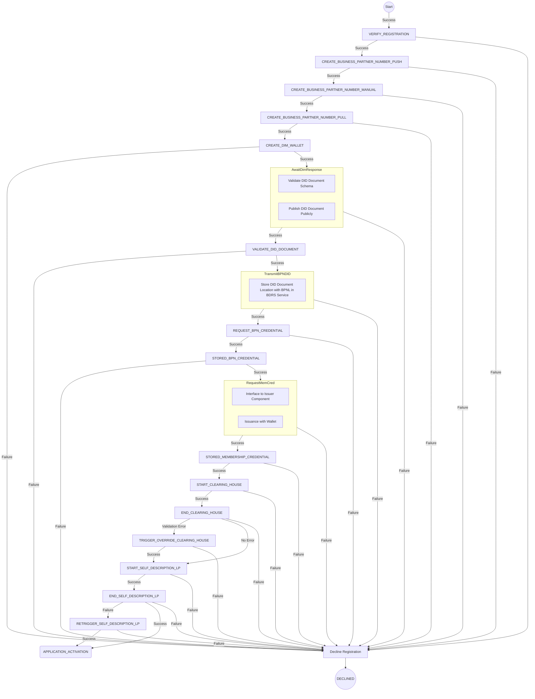

```mermaid
flowchart TD

    Start((Start)) -->|Success| VerifyReg[VERIFY_REGISTRATION]

    VerifyReg[VERIFY_REGISTRATION] -->|Success| CreateBPNNPush[CREATE_BUSINESS_PARTNER_NUMBER_PUSH]

    CreateBPNNPush -->|Success| CreateBPNNManual[CREATE_BUSINESS_PARTNER_NUMBER_MANUAL]

    CreateBPNNManual -->|Success| CreateBPNNPull[CREATE_BUSINESS_PARTNER_NUMBER_PULL]

    CreateBPNNPull -->|Success| CreateDimWallet[CREATE_DIM_WALLET]

    CreateDimWallet -->|Success| AwaitDimResponse[AWAIT_DIM_RESPONSE]
   
    subgraph AwaitDimResponse

        ValidateSchema[Validate DID Document Schema]

        PublishPublic[Publish DID Document Publicly]

    end
   
    AwaitDimResponse -->|Success| ValidateDidDoc[VALIDATE_DID_DOCUMENT]

    ValidateDidDoc -->|Success| TransmitBPNDID[TRANSMIT_BPN_DID]
   
    subgraph TransmitBPNDID

        StoreDIDLocBPNL[Store DID Document Location with BPNL in BDRS Service]

    end
   
    TransmitBPNDID -->|Success| RequestBPNCred[REQUEST_BPN_CREDENTIAL]

    RequestBPNCred -->|Success| StoredBPNCred[STORED_BPN_CREDENTIAL]
   
    StoredBPNCred -->|Success| RequestMemCred[REQUEST_MEMBERSHIP_CREDENTIAL]
   
    subgraph RequestMemCred

        InterfaceIssuer[Interface to Issuer Component]

        IssueWithWallet[Issuance with Wallet]

    end
   
    RequestMemCred -->|Success| StoredMemCred[STORED_MEMBERSHIP_CREDENTIAL]

    StoredMemCred -->|Success| StartClearing[START_CLEARING_HOUSE]

    StartClearing -->|Success| EndClearing[END_CLEARING_HOUSE]
   
    EndClearing -->|Validation Error| TriggerOverride[TRIGGER_OVERRIDE_CLEARING_HOUSE]

    EndClearing -->|No Error| StartSelfDescLP[START_SELF_DESCRIPTION_LP]
   
    StartSelfDescLP -->|Success| EndSelfDescLP[END_SELF_DESCRIPTION_LP]
    
    EndSelfDescLP -->|Failure| RetriggerSelfDescLP[RETRIGGER_SELF_DESCRIPTION_LP]

    EndSelfDescLP -->|Success| Finish(APPLICATION_ACTIVATION)
   
    TriggerOverride -->|Success| StartSelfDescLP

    RetriggerSelfDescLP -->|Success| Finish

    VerifyReg --> DeclineReg[Decline Registration]:::declineProcess --> Declined((DECLINED))

    CreateBPNNPush -->|Failure| DeclineReg
    CreateBPNNManual -->|Failure| DeclineReg
    CreateBPNNPull -->|Failure| DeclineReg
    CreateDimWallet -->|Failure| DeclineReg
    AwaitDimResponse -->|Failure| DeclineReg
    ValidateDidDoc -->|Failure| DeclineReg
    TransmitBPNDID -->|Failure| DeclineReg
    RequestBPNCred -->|Failure| DeclineReg
    StoredBPNCred -->|Failure| DeclineReg
    RequestMemCred -->|Failure| DeclineReg
    StoredMemCred -->|Failure| DeclineReg
    StartClearing -->|Failure| DeclineReg
    EndClearing -->|Failure| DeclineReg
    StartSelfDescLP -->|Failure| DeclineReg
    EndSelfDescLP -->|Failure| DeclineReg
    TriggerOverride -->|Failure| DeclineReg
    RetriggerSelfDescLP -->|Failure| DeclineReg
```