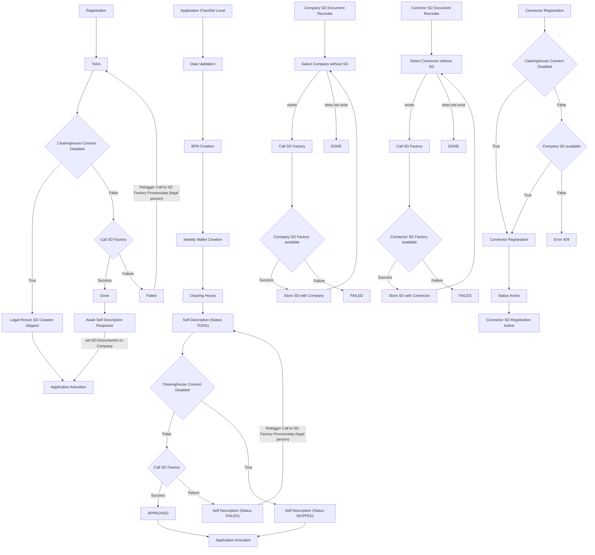

```mermaid
flowchart TD
    A[Registration]
    A --> D 
    C[Legal Person SD Creation skipped]
    D[ToDo]
    E[Done]
    F[Failed]
    H{Clearinghouse Connect Disabled}
    I{Call SD Factory}
    D --> H
    H -->|True|C
    H -->|False|I
    I -->|Success|E
    I -->|Failure|F
    F -->|"Retrigger Call to SD Factory Processstep (legal person)"|D
    J[Await Self Description Response]
    E --> J
    K[Application Activation]
    J -->|set SD-DocumentId on Company| K
    C --> K
    AA[Application Checklist Level]
    AE[Data Validation]
    AF[BPN Creation]
    AG[Identity Wallet Creation]
    AH[Clearing House]
    AI["Self Description (Status TODO)"]
    AA --> AE
    AE --> AF
    AF --> AG
    AG --> AH
    AH --> AI
    AI --> AB
    AB{Clearinghouse Connect Disabled}
    AB -->|False| AJ
    AJ{Call SD Factory}
    AK["Self Description (Status FAILED)"]
    AD[APPROVED]
    AB -->|True|AC
    AJ -->|Success|AD
    AJ -->|Failure|AK
    AK -->|"Retrigger Call to SD Factory Processstep (legal person)"|AI
    AC["Self Description (Status SKIPPED)"]
    AL[Application Activated]
    AC --> AL
    AD --> AL
    BA[Connector Registration]
    BB{Clearinghouse Connect Disabled}
    BA --> BB
    BB -->|True|BE
    BB -->|False|BD
    BD{Company SD available}
    BE[Connector Registration]
    BF[Error 409]
    BD -->|True|BE
    BD -->|False|BF
    BG[Status Active]
    BE --> BG
    BH[Connector SD Registration Active]
    BG --> BH
    CA[Company SD Document Recreate]
    CB[Select Company without SD]
    CA --> CB
    CC[Call SD Factory]
    CB -->|exists| CC
    CD[Store SD with Company]
    CE[DONE]
    CB -->|does not exist|CE
    CF{Company SD Factory available}
    CC --> CF
    CF -->|Success|CD
    CD --> CB
    CG[FAILED]
    CF -->|Failure|CG

    DA[Connctor SD Document Recreate]
    DB[Select Connector without SD]
    DA --> DB
    DC[Call SD Factory]
    DB -->|exists| DC
    DD[Store SD with Connector]
    DE[DONE]
    DB -->|does not exist|DE
    DF{Connector SD Factory available}
    DC --> DF
    DF -->|Success|DD
    DD --> DB
    DG[FAILED]
    DF -->|Failure|DG
```
