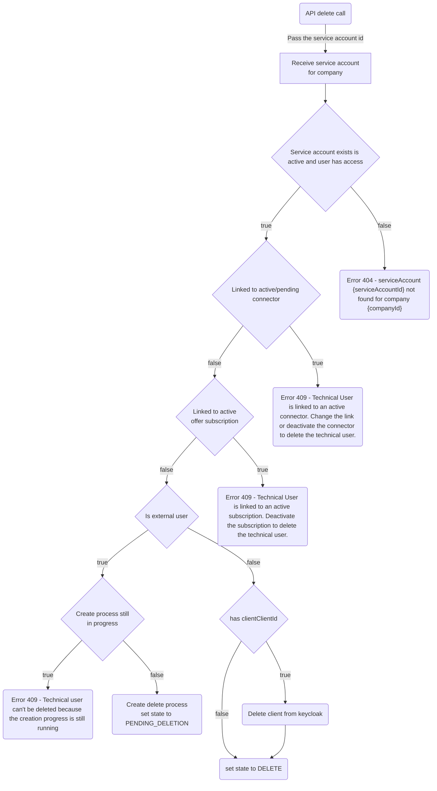

## Delete an user

Technical users created under the same company id can get deleted by user administrators.
To delete an user, just open up the user details and click the "delete" button.


#### Currently not supported:

update technical user secret

### Delete Service Account

Delete an existing service account  
Only service accounts of the own company can get deleted.
Permission: "delete_tech_user_management"

As part of the deletion API, the following tasks get executed:



Endpoint can be called via:

```diff
! DELETE: api/administration/owncompany/serviceaccounts/{serviceAccountId}
```

Validation:

- only owned or managed service account that are active can get deleted
- the deletion is not possible if the user is linked to an `active` offer subscription or an connector in state `active` or `pending`

> **_NOTE:_** Technical user owner as well as provider (managed tech user owner) can run the delete endpoint.

## NOTICE

This work is licensed under the [Apache-2.0](https://www.apache.org/licenses/LICENSE-2.0).

- SPDX-License-Identifier: Apache-2.0
- SPDX-FileCopyrightText: 2023 Contributors to the Eclipse Foundation
- Source URL: https://github.com/eclipse-tractusx/portal-assets
