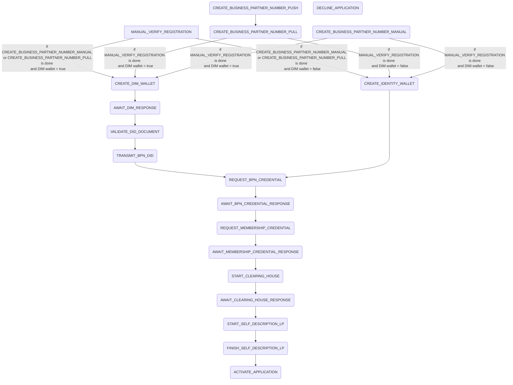

# Application Checklist Process

## Summary

The application checklist process handles the registration process for a new company. The process steps are the following:

## External dependencies

The process worker communicates with the DIM (Decentralized Identity Management) middle layer to create the wallet, or if disabled with the miw to create the wallet. It further more communicates with the bpdm, clearinghouse, the SD factory, the ssi-credential-issuer, keycloak, bpn did resolver and an universal resolver.

## Process Steps

### MANUAL_VERIFY_REGISTRATION

The process step `CREATE_DIM_TECHNICAL_USER` is not triggered by the process worker it self, it will be processed either when the registration is approved via the endpoint `POST: api/administration/registration/application/{applicationId}/approve` or via the decline endpoint `POST: api/administration/registration/application/{applicationId}/decline`.

### CREATE_BUSINESS_PARTNER_NUMBER_MANUAL

The process step `CREATE_BUSINESS_PARTNER_NUMBER_MANUAL` is not triggered by the process worker. It is triggered via the endpoint `POST: /api/administration/registration/application/{applicationId}/{bpn}/bpn`.

### CREATE_BUSINESS_PARTNER_NUMBER_PUSH

The process step `CREATE_BUSINESS_PARTNER_NUMBER_PUSH` retrieves the bpdm data and triggers the input/business-partners endpoint of the bpdm service. And triggers the setSharingState endpoint of the bdpm service.

### CREATE_BUSINESS_PARTNER_NUMBER_PULL

The process step `CREATE_BUSINESS_PARTNER_NUMBER_PULL` fetches the legal entity from the bpdm service via the application id. If the legal entity doesn't have the bpn set the process will stay in `TODO`. If the bpn is set for the legal entity the process step is done.

### CREATE_IDENTITY_WALLET

The process step `CREATE_IDENTITY_WALLET` will only be executed if the DIM wallet creation is disabled and the application checklist steps `BUSINESS_PARTNER_NUMBER` and `REGISTRATION_VERIFICATION` are done. The process step gets the companyName and businessPartnerNumber and calls the miw to create the wallet.

### CREATE_DIM_WALLET

The process step `CREATE_DIM_WALLET` will only be executed if the DIM wallet creation is enabled and the application checklist steps `BUSINESS_PARTNER_NUMBER` and `REGISTRATION_VERIFICATION` are done. The process step gets the companyName and businessPartnerNumber and calls the DIM middle layer to create the wallet.

### AWAIT_DIM_RESPONSE

The process step `AWAIT_DIM_RESPONSE` is not triggered by the process worker. It will only be triggered by the endpoint `POST: api/administration/registration/DIM/{bpn}`. The endpoint receives the did, the did document and the authenticationDetails for the created wallet. It than validates the did format and the schema of the did document, if one of those checks fail, the process will be set to failed. Finally the information are saved in the database.

### VALIDATE_DID_DOCUMENT

The process step `VALIDATE_DID_DOCUMENT` retrieves the did from the database and validates it via an universalResolver to check that the structure is correct.

### TRANSMIT_BPN_DID

The process step `TRANSMIT_BPN_DID` retrieves the bpn and did. It than transmits the details to the bpn did resolver.

### REQUEST_BPN_CREDENTIAL

The process step `REQUEST_BPN_CREDENTIAL` gets the necessary data for the bpn credential creation and calls the issuer component to request the bpn credential. it will post a callback url for the issuer component to do the callback with the status of the credential creation.

### AWAIT_BPN_CREDENTIAL_RESPONSE

The process step `AWAIT_BPN_CREDENTIAL_RESPONSE` is only triggered via api `POST: api/administration/registration/issuer/bpncredential`, the issuer component sends an response to the credential creation regarding its success or error. If the creation was successful the process continues as displayed above. If it fails the process step is failed.

### REQUEST_MEMBERSHIP_CREDENTIAL

The process step `REQUEST_MEMBERSHIP_CREDENTIAL` gets the necessary data for the membership credential creation and calls the issuer component to request the membership credential. it will post a callback url for the issuer component to do the callback with the status of the credential creation.

### AWAIT_MEMBERSHIP_CREDENTIAL_RESPONSE

The process step `AWAIT_MEMBERSHIP_CREDENTIAL_RESPONSE` is only triggered via api `POST: api/administration/registration/issuer/membershipcredential`, the issuer component sends an response to the credential creation regarding its success or error. If the creation was successful the process continues as displayed above. If it fails the process step is failed.

### START_CLEARING_HOUSE

The process step `START_CLEARING_HOUSE` retrieves the company did. If the wallet was created via the DIM middle layer the did is retrieved from the database, if the wallet was created via the miw the did is retrieved via the `/api/wallets` endpoint of the miw. Than all necessary data for the `POST: /api/v1/validation` endpoint are retrieved from the database and the call to clearinghouse is executed.

### AWAIT_CLEARING_HOUSE_RESPONSE

The process step `AWAIT_CLEARING_HOUSE_RESPONSE` is only triggered via the api `POST api/administration/registration/clearinghouse`. The clearinghouse sends an status to the portal with either the successful validation or an `decline` status. If the status is `DECLINE` the process will be set to failed, otherwise the process continues.

### START_SELF_DESCRIPTION_LP

The process step `START_SELF_DESCRIPTION_LP` can be disabled with the `ClearinghouseConnectDisabled` flag in the config. If it is disabled the process step will be skipped. If it is enabled the SD factory is called to request an self description document for the company.

### FINISH_SELF_DESCRIPTION_LP

The process step `FINISH_SELF_DESCRIPTION_LP` is only triggered via the api `POST: api/administration/registration/clearinghouse/selfDescription`. The SD factory will post the created SD document to the portal. The backend will save the SD document in the database and link it to the company.

### ACTIVATE_APPLICATION

In the process step `ACTIVATE_APPLICATION` the users of the onboarded company will be assigned with the correct roles for the portal as well as the bpn mapper in the central idp. After that the theme is set for the shared realm. The company application is set to active and the company is set to active. If it is an external company application, an `TRIGGER_CALLBACK_OSP_APPROVED` is created. All company admins will than be notified via the notification logic in the portal. And for the same users a [mail process](/docs/user/Process%20Workers/mailing.md) is created.

## Retrigger

| Step Name                             | Retrigger Step                          | Retrigger Endpoint                                                                          |
| ------------------------------------- | --------------------------------------- | ------------------------------------------------------------------------------------------- |
| MANUAL_VERIFY_REGISTRATION            | N/A                                     |                                                                                             |
| CREATE_BUSINESS_PARTNER_NUMBER_PUSH   | RETRIGGER_BUSINESS_PARTNER_NUMBER_PUSH  | api/administration/registration/application/{applicationId}/trigger-bpn                     |
| CREATE_BUSINESS_PARTNER_NUMBER_PULL   | RETRIGGER_BUSINESS_PARTNER_NUMBER_PULL  | api/administration/registration/application/{applicationId}/trigger-bpn                     |
| CREATE_BUSINESS_PARTNER_NUMBER_MANUAL | N/A                                     |                                                                                             |
| CREATE_IDENTITY_WALLET                | RETRIGGER_IDENTITY_WALLET               | api/administration/registration/application/{applicationId}/trigger-identity-wallet         |
| START_CLEARING_HOUSE                  | RETRIGGER_CLEARING_HOUSE                | api/administration/registration/application/{applicationId}/retrigger-clearinghouse         |
| AWAIT_CLEARING_HOUSE_RESPONSE         | N/A                                     |                                                                                             |
| START_SELF_DESCRIPTION_LP             | RETRIGGER_SELF_DESCRIPTION_LP           | api/administration/registration/application/{applicationId}/trigger-self-description        |
| ACTIVATE_APPLICATION                  | N/A                                     |                                                                                             |
| START_OVERRIDE_CLEARING_HOUSE         | RETRIGGER_OVERRIDE_CLEARING_HOUSE       | api/administration/registration/application/{applicationId}/override-clearinghouse          |
| FINISH_SELF_DESCRIPTION_LP            | N/A                                     |                                                                                             |
| DECLINE_APPLICATION                   | N/A                                     |                                                                                             |
| CREATE_DIM_WALLET                     | RETRIGGER_CREATE_DIM_WALLET             | api/administration/registration/application/{applicationId}/retrigger-create-DIM-wallet     |
| AWAIT_DIM_RESPONSE                    | N/A                                     |                                                                                             |
| VALIDATE_DID_DOCUMENT                 | RETRIGGER_VALIDATE_DID_DOCUMENT         | api/administration/registration/application/{applicationId}/retrigger-validate-did          |
| REQUEST_BPN_CREDENTIAL                | RETRIGGER_REQUEST_BPN_CREDENTIAL        | api/administration/registration/application/{applicationId}/retrigger-bpn-credential        |
| AWAIT_BPN_CREDENTIAL_RESPONSE         | N/A                                     |                                                                                             |
| REQUEST_MEMBERSHIP_CREDENTIAL         | RETRIGGER_REQUEST_MEMBERSHIP_CREDENTIAL | api/administration/registration/application/{applicationId}/retrigger-membership-credential |
| AWAIT_MEMBERSHIP_CREDENTIAL_RESPONSE  | N/A                                     |                                                                                             |
| TRANSMIT_BPN_DID                      | RETRIGGER_TRANSMIT_DID_BPN              | api/administration/registration/application/{applicationId}/retrigger-transmit-bpn-did      |

## NOTICE

This work is licensed under the [Apache-2.0](https://www.apache.org/licenses/LICENSE-2.0).

- SPDX-License-Identifier: Apache-2.0
- SPDX-FileCopyrightText: 2024 Contributors to the Eclipse Foundation
- Source URL: https://github.com/eclipse-tractusx/portal-assets
