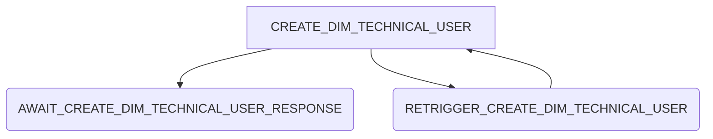

# Dim User Creation

## Summary

The dim user creation handles the creation of technical users in the dim middle layer. The process steps are the following:

## External dependencies

The process worker communicates with the dim middle layer to create the technical users

## Process Steps

### CREATE_DIM_TECHNICAL_USER

The process step `CREATE_DIM_TECHNICAL_USER` retrieves service account details from the database, those are the business partner number and the name of the service account and calls the dim middle layer to create a technical user on the dim side. A process id is send in the request to the dim to be able to set the service account data in the `AWAIT_CREATE_DIM_TECHNICAL_USER_RESPONSE`.

### AWAIT_CREATE_DIM_TECHNICAL_USER_RESPONSE

The process step is just a placeholder to retrieve the service account data on api level from the dim. The technical user will than be extended with the data that are retrieved from the dim middle layer.

## Retrigger

| Step Name                                | Retrigger Possible | Retrigger Endpoint |
| ---------------------------------------- | ------------------ | ------------------ |
| CREATE_DIM_TECHNICAL_USER                | YES                | missing            |
| AWAIT_CREATE_DIM_TECHNICAL_USER_RESPONSE | YES                | missing            |
| RETRIGGER_CREATE_DIM_TECHNICAL_USER      | NO                 |                    |

## NOTICE

This work is licensed under the [Apache-2.0](https://www.apache.org/licenses/LICENSE-2.0).

- SPDX-License-Identifier: Apache-2.0
- SPDX-FileCopyrightText: 2024 Contributors to the Eclipse Foundation
- Source URL: https://github.com/eclipse-tractusx/portal-assets
