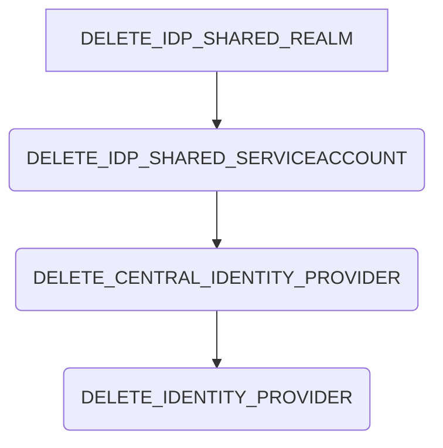

# Summary

The identity provider provisioning process cleans up the identity provider in the shared and central idp. The process steps are the following:

## External dependencies

The process worker communicates with the shared and central idp.

## DELETE_IDP_SHARED_REALM

The process step `DELETE_IDP_SHARED_REALM` deletes the shared realm based on the iam alias.

## DELETE_IDP_SHARED_SERVICEACCOUNT

The process step `DELETE_IDP_SHARED_SERVICEACCOUNT` deletes the service account of the identity provider from the shared idp.

## DELETE_CENTRAL_IDENTITY_PROVIDER

The process step `DELETE_CENTRAL_IDENTITY_PROVIDER` deletes the identity provider from the central idp based on the iam alias.

## DELETE_IDENTITY_PROVIDER

The process step `DELETE_IDENTITY_PROVIDER` deletes the identity provider from the database.

## NOTICE

This work is licensed under the [Apache-2.0](https://www.apache.org/licenses/LICENSE-2.0).

- SPDX-License-Identifier: Apache-2.0
- SPDX-FileCopyrightText: 2024 Contributors to the Eclipse Foundation
- Source URL: https://github.com/eclipse-tractusx/portal-assets
