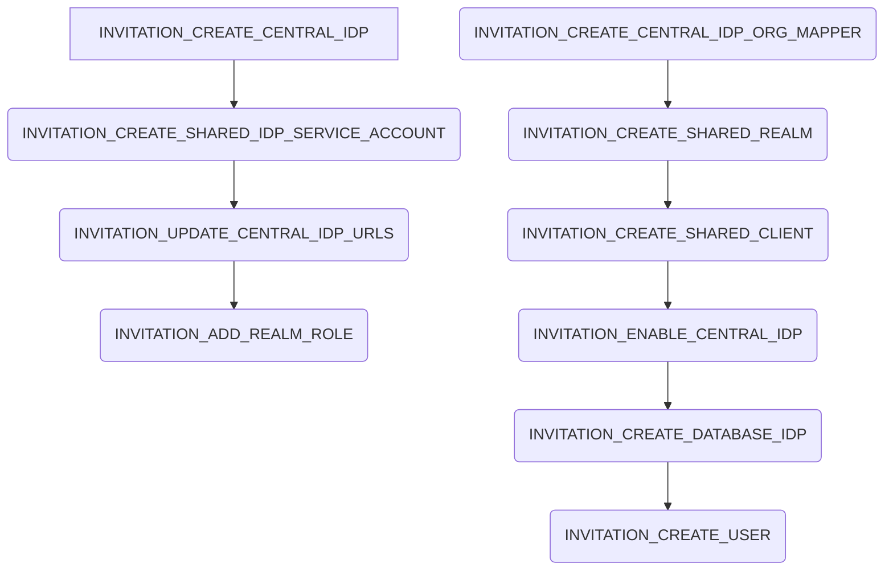

# Invitation Process

## Summary

The invitation process handles the creation of the central and shared idp data and users for a new company. The process steps are the following:

## External dependencies

The process worker communicates with the shared and central idp.

## Process Steps

### INVITATION_CREATE_CENTRAL_IDP

The process step `INVITATION_CREATE_CENTRAL_IDP` creates the identity provider on the central idp.

## INVITATION_CREATE_SHARED_IDP_SERVICE_ACCOUNT

The process step `INVITATION_CREATE_SHARED_IDP_SERVICE_ACCOUNT` creates a client on the shared idp which is a service account. The clientId and secret is saved in the database for the next process steps until it is cleaned up.

### INVITATION_UPDATE_CENTRAL_IDP_URLS

The process step `INVITATION_UPDATE_CENTRAL_IDP_URLS` retrieves the information from the created service account client on the shared idp and updates the identity provider on the central idp.

### INVITATION_ADD_REALM_ROLE

The process step `INVITATION_ADD_REALM_ROLE` adds the `create-realm` to the created shared service account.

### INVITATION_CREATE_CENTRAL_IDP_ORG_MAPPER

The process step `INVITATION_CREATE_CENTRAL_IDP_ORG_MAPPER` sets the organization name in the central idp

### INVITATION_CREATE_SHARED_REALM

The process step `INVITATION_CREATE_SHARED_REALM` creates the shared realm.

### INVITATION_CREATE_SHARED_CLIENT

The process step `INVITATION_CREATE_SHARED_CLIENT` create the client on the shared idp.

### INVITATION_ENABLE_CENTRAL_IDP

The process step `INVITATION_ENABLE_CENTRAL_IDP` enables the central idp client.

### INVITATION_CREATE_DATABASE_IDP

The process step `INVITATION_CREATE_DATABASE_IDP` handles all write access to the database to create the identity provider and handles the initial application checklist creation.

### INVITATION_CREATE_USER

The process step `INVITATION_CREATE_USER` determines the user roles for newly created users and creates the users in the central idp. After the creation a mail process is added to the database.

## Retrigger

| Step Name                                              | Retrigger Possible | Retrigger Endpoint                                                                 |
| ------------------------------------------------------ | ------------------ | ---------------------------------------------------------------------------------- |
| INVITATION_CREATE_CENTRAL_IDP                          | YES                | api/administration/invitation/{processId}/retrigger-create-central-idp             |
| INVITATION_CREATE_SHARED_IDP_SERVICE_ACCOUNT           | YES                | api/administration/invitation/{processId}/retrigger-create-shared-idp-sa           |
| INVITATION_ADD_REALM_ROLE                              | YES                | missing                                                                            |
| INVITATION_CREATE_SHARED_REALM                         | YES                | api/administration/invitation/{processId}/retrigger-create-shared-realm-idp-client |
| INVITATION_CREATE_CENTRAL_IDP_ORG_MAPPER               | YES                | api/administration/invitation/{processId}/retrigger-create-central-idp-org-mapper  |
| INVITATION_UPDATE_CENTRAL_IDP_URLS                     | YES                | api/administration/invitation/{processId}/retrigger-update-central-idp-urls        |
| INVITATION_CREATE_SHARED_CLIENT                        | YES                | missing                                                                            |
| INVITATION_ENABLE_CENTRAL_IDP                          | YES                | api/administration/invitation/{processId}/retrigger-enable-central-idp             |
| INVITATION_CREATE_DATABASE_IDP                         | YES                | api/administration/invitation/{processId}/retrigger-create-database-idp            |
| INVITATION_CREATE_USER                                 | YES                | api/administration/invitation/{processId}/retrigger-create-user                    |
| RETRIGGER_INVITATION_CREATE_CENTRAL_IDP                | NO                 |                                                                                    |
| RETRIGGER_INVITATION_CREATE_SHARED_IDP_SERVICE_ACCOUNT | NO                 |                                                                                    |
| RETRIGGER_INVITATION_ADD_REALM_ROLE                    | NO                 |                                                                                    |
| RETRIGGER_INVITATION_CREATE_SHARED_REALM               | NO                 |                                                                                    |
| RETRIGGER_INVITATION_CREATE_CENTRAL_IDP_ORG_MAPPER     | NO                 |                                                                                    |
| RETRIGGER_INVITATION_UPDATE_CENTRAL_IDP_URLS           | NO                 |                                                                                    |
| RETRIGGER_INVITATION_CREATE_SHARED_CLIENT              | NO                 |                                                                                    |
| RETRIGGER_INVITATION_ENABLE_CENTRAL_IDP                | NO                 |                                                                                    |
| RETRIGGER_INVITATION_CREATE_USER                       | NO                 |                                                                                    |
| RETRIGGER_INVITATION_CREATE_DATABASE_IDP               | NO                 |                                                                                    |

## NOTICE

This work is licensed under the [Apache-2.0](https://www.apache.org/licenses/LICENSE-2.0).

- SPDX-License-Identifier: Apache-2.0
- SPDX-FileCopyrightText: 2024 Contributors to the Eclipse Foundation
- Source URL: https://github.com/eclipse-tractusx/portal-assets
