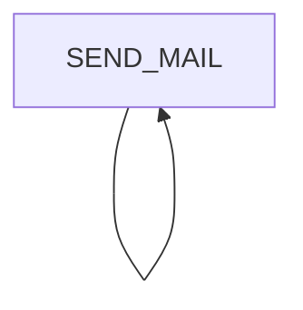

# Mailing Process

## Summary

The mailing process is responsible for sending emails to users. Therefore, it retrieves all entries from the `mailing_informations` table with the status `PENDING`. The process steps are the following:

## Process Steps

### External dependencies

The process worker communicates with the email service.

### SEND_MAIL

The process step `SEND_MAIL` retrieves two entries from the `mailing_informations` table with status `PENDING` if available. The first one will be send as a mail, if there are more than one entry available the process step will create a new `SEND_MAIL` process step.

## Retrigger

| Step Name | Retrigger Step      | Retrigger Endpoint                           |
| --------- | ------------------- | -------------------------------------------- |
| SEND_MAIL | RETRIGGER_SEND_MAIL | /api/administration/mail/retrigger-send-mail |

## NOTICE

This work is licensed under the [Apache-2.0](https://www.apache.org/licenses/LICENSE-2.0).

- SPDX-License-Identifier: Apache-2.0
- SPDX-FileCopyrightText: 2024 Contributors to the Eclipse Foundation
- Source URL: https://github.com/eclipse-tractusx/portal-assets
