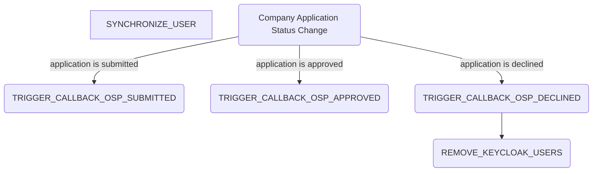

# Network Registration Process

## Summary

The network registration process handles the synchronization of users, the handling of the callback logic for the osp and the user removal. The process steps are the following:

## External dependencies

The process worker communicates with the shared and central idp.

## Process Steps

### SYNCHRONIZE_USER

The process step `SYNCHRONIZE_USER` gets the identity providers for a specific network registration and creates the user in the central idp.

### TRIGGER_CALLBACK_OSP_SUBMITTED, TRIGGER_CALLBACK_OSP_APPROVED, TRIGGER_CALLBACK_OSP_DECLINED

The process steps `TRIGGER_CALLBACK_OSP_SUBMITTED`, `TRIGGER_CALLBACK_OSP_APPROVED`, `TRIGGER_CALLBACK_OSP_DECLINED` gets the necessary callback data from the database for a specific network registration. It handles the three cases for an application `SUBMITTED`, `APPROVED`, `DECLINED` and sends a callback to the osp. If the osp does not have a callback url configured the process step is skipped.

### REMOVE_KEYCLOAK_USERS

The process step `REMOVE_KEYCLOAK_USERS` is created when an network registration is declined. It will remove all Keycloak users. It will proceed one user at a time and if more users are available for deletion it will create the same process step again.

## Retrigger

| Step Name                        | Retrigger Possible | Retrigger Endpoint                                                                    |
| -------------------------------- | ------------------ | ------------------------------------------------------------------------------------- |
| SYNCHRONIZE_USER                 | YES                | api/administration/registration/network/{externalId}/retrigger-synchronize-users      |
| RETRIGGER_SYNCHRONIZE_USER       | NO                 |                                                                                       |
| TRIGGER_CALLBACK_OSP_SUBMITTED   | YES                | api/administration/registration/network/{externalId}/retrigger-callback-osp-submitted |
| TRIGGER_CALLBACK_OSP_APPROVED    | YES                | api/administration/registration/network/{externalId}/retrigger-callback-osp-approve   |
| TRIGGER_CALLBACK_OSP_DECLINED    | YES                | api/administration/registration/network/{externalId}/retrigger-callback-osp-decline   |
| RETRIGGER_CALLBACK_OSP_SUBMITTED | NO                 |                                                                                       |
| RETRIGGER_CALLBACK_OSP_APPROVED  | NO                 |                                                                                       |
| RETRIGGER_CALLBACK_OSP_DECLINED  | NO                 |                                                                                       |
| MANUAL_DECLINE_OSP               | NO                 |                                                                                       |

## NOTICE

This work is licensed under the [Apache-2.0](https://www.apache.org/licenses/LICENSE-2.0).

- SPDX-License-Identifier: Apache-2.0
- SPDX-FileCopyrightText: 2024 Contributors to the Eclipse Foundation
- Source URL: https://github.com/eclipse-tractusx/portal-assets
