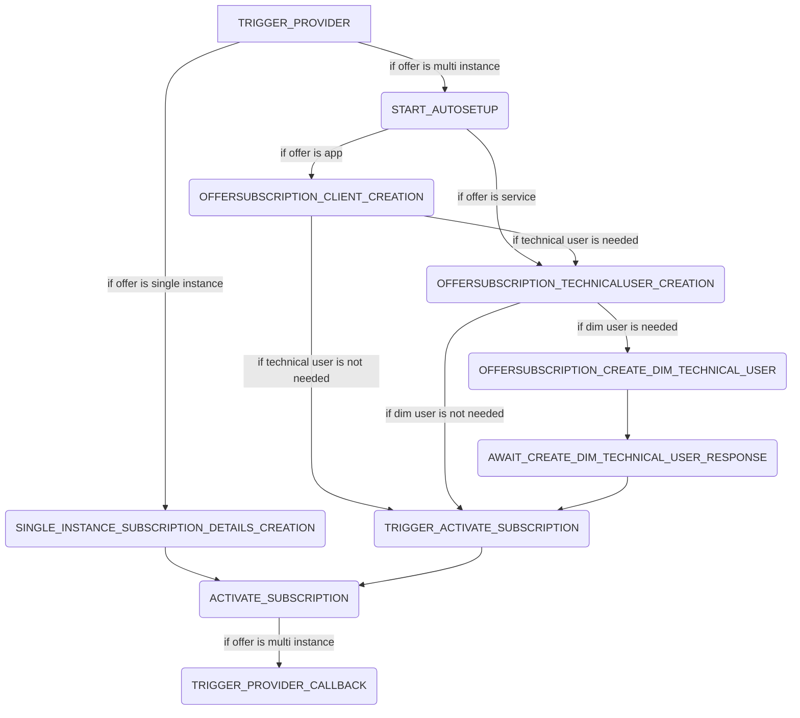

# Offer Subscription Process

## Summary

The offer subscription process handles the subscription and automatic activation for an offer. The process steps are the following:

## External dependencies

The process worker communicates with the hoster of the offer if a callback url is set up.

## Process Steps

### TRIGGER_PROVIDER

The process step `TRIGGER_PROVIDER` checks whether the app is a multi instance app and that the provider has setup an auto setup url, if so the auto setup url of the provider will be triggered with information of the new subscription. Otherwise the step is skipped.

### SINGLE_INSTANCE_SUBSCRIPTION_DETAILS_CREATION

The process step `SINGLE_INSTANCE_SUBSCRIPTION_DETAILS_CREATION` is triggered via the `PUT: /api/apps/subscription/{offerSubscriptionId}/activate-single-instance` endpoint. It will create subscription details for the app and trigger the [ACTIVATE_SUBSCRIPTION](#activate_subscription) process step

### START_AUTOSETUP

The process step `START_AUTOSETUP` is either triggered via the `POST: /api/apps/start-autoSetup` or the `POST: /api/apps/start-autoSetup` endpoint. When triggering one of the endpoints the offer provider must provide the offer url, this will be saved in the offer process data. Depending if the offer is an app it will either continue with the [OFFERSUBSCRIPTION_CLIENT_CREATION](#offersubscription_client_creation) process step for apps or the [OFFERSUBSCRIPTION_TECHNICALUSER_CREATION](#offersubscription_technicaluser_creation) process step for services.

### OFFERSUBSCRIPTION_CLIENT_CREATION

The process step `OFFERSUBSCRIPTION_CLIENT_CREATION` will create the client in the central idp and an app instance. If the offer depends on technical users it will continue with the [OFFERSUBSCRIPTION_TECHNICALUSER_CREATION](#offersubscription_technicaluser_creation) process step if a technical user is needed, otherwise with [TRIGGER_ACTIVATE_SUBSCRIPTION](#trigger_activate_subscription)

### OFFERSUBSCRIPTION_TECHNICALUSER_CREATION

The process step `OFFERSUBSCRIPTION_CLIENT_CREATION` creates the needed technical users. If an external technical user is needed the process will continue with the [OFFERSUBSCRIPTION_CREATE_DIM_TECHNICAL_USER](#offersubscription_create_dim_technical_user) otherwise it will continue with [TRIGGER_ACTIVATE_SUBSCRIPTION](#trigger_activate_subscription)

### OFFERSUBSCRIPTION_CREATE_DIM_TECHNICAL_USER

The process step `OFFERSUBSCRIPTION_CREATE_DIM_TECHNICAL_USER` creates the external technical user and will await the external response.

### ACTIVATE_SUBSCRIPTION

The process step `ACTIVATE_SUBSCRIPTION` enables the client and service account in the central idp, creates notifications and cleans up the offer subscription process data from the database.

### TRIGGER_ACTIVATE_SUBSCRIPTION

The process step `TRIGGER_ACTIVATE_SUBSCRIPTION` is called by either `PUT: /api/services/supscription/{subscriptiondId}/activate` or `PUT: /api/apps/subscription/{subscriptiondId}/activate` when triggered it will proceed with the [ACTIVATE_SUBSCRIPTION](#activate_subscription)

### TRIGGER_PROVIDER_CALLBACK

The process step `TRIGGER_PROVIDER_CALLBACK` triggers the provider callback url with the information of the service accounts

## Retrigger

| Step Name                                             | Retrigger Possible | Retrigger Endpoint                                                                                                            |
| ----------------------------------------------------- | ------------------ | ----------------------------------------------------------------------------------------------------------------------------- |
| TRIGGER_PROVIDER                                      | YES                | api/administration/subscriptionconfiguration/process/offer-subscription/{offerSubscriptionId}/retrigger-provider-callback     |
| START_AUTOSETUP                                       | NO                 |                                                                                                                               |
| OFFERSUBSCRIPTION_CLIENT_CREATION                     | YES                | api/administration/subscriptionconfiguration/process/offer-subscription/{offerSubscriptionId}/retrigger-create-client         |
| SINGLE_INSTANCE_SUBSCRIPTION_DETAILS_CREATION         | NO                 |                                                                                                                               |
| OFFERSUBSCRIPTION_TECHNICALUSER_CREATION              | YES                | api/administration/subscriptionconfiguration/process/offer-subscription/{offerSubscriptionId}/retrigger-create-technical-user |
| ACTIVATE_SUBSCRIPTION                                 | NO                 |                                                                                                                               |
| TRIGGER_PROVIDER_CALLBACK                             | YES                | api/administration/subscriptionconfiguration/process/offer-subscription/{offerSubscriptionId}/retrigger-provider-callback     |
| RETRIGGER_PROVIDER                                    | NO                 |                                                                                                                               |
| RETRIGGER_OFFERSUBSCRIPTION_CLIENT_CREATION           | NO                 |                                                                                                                               |
| RETRIGGER_OFFERSUBSCRIPTION_TECHNICALUSER_CREATION    | NO                 |                                                                                                                               |
| RETRIGGER_PROVIDER_CALLBACK                           | NO                 |                                                                                                                               |
| TRIGGER_ACTIVATE_SUBSCRIPTION                         | NO                 |                                                                                                                               |
| OFFERSUBSCRIPTION_CREATE_DIM_TECHNICAL_USER           | YES                | missing                                                                                                                       |
| RETRIGGER_OFFERSUBSCRIPTION_CREATE_DIM_TECHNICAL_USER | NO                 |                                                                                                                               |
| AWAIT_CREATE_DIM_TECHNICAL_USER_RESPONSE              | YES                | missing                                                                                                                       |
| RETRIGGER_AWAIT_CREATE_DIM_TECHNICAL_USER_RESPONSE    | NO                 |                                                                                                                               |

## NOTICE

This work is licensed under the [Apache-2.0](https://www.apache.org/licenses/LICENSE-2.0).

- SPDX-License-Identifier: Apache-2.0
- SPDX-FileCopyrightText: 2024 Contributors to the Eclipse Foundation
- Source URL: https://github.com/eclipse-tractusx/portal-assets
