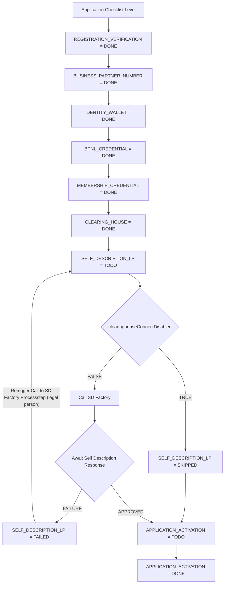
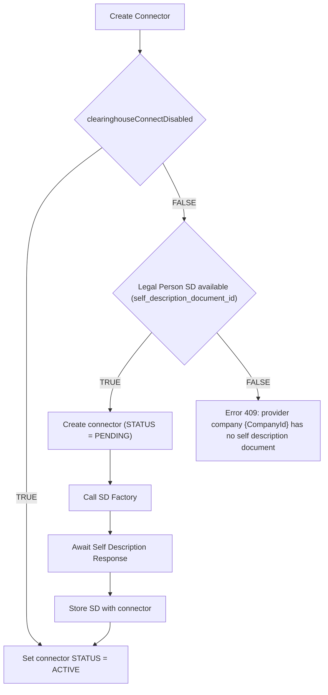
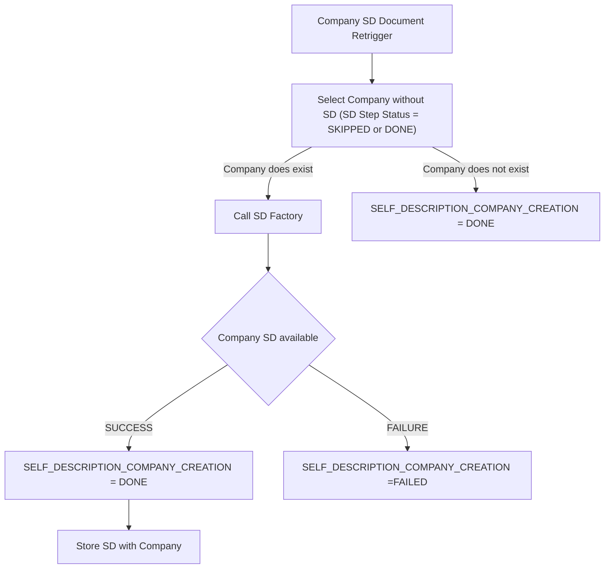
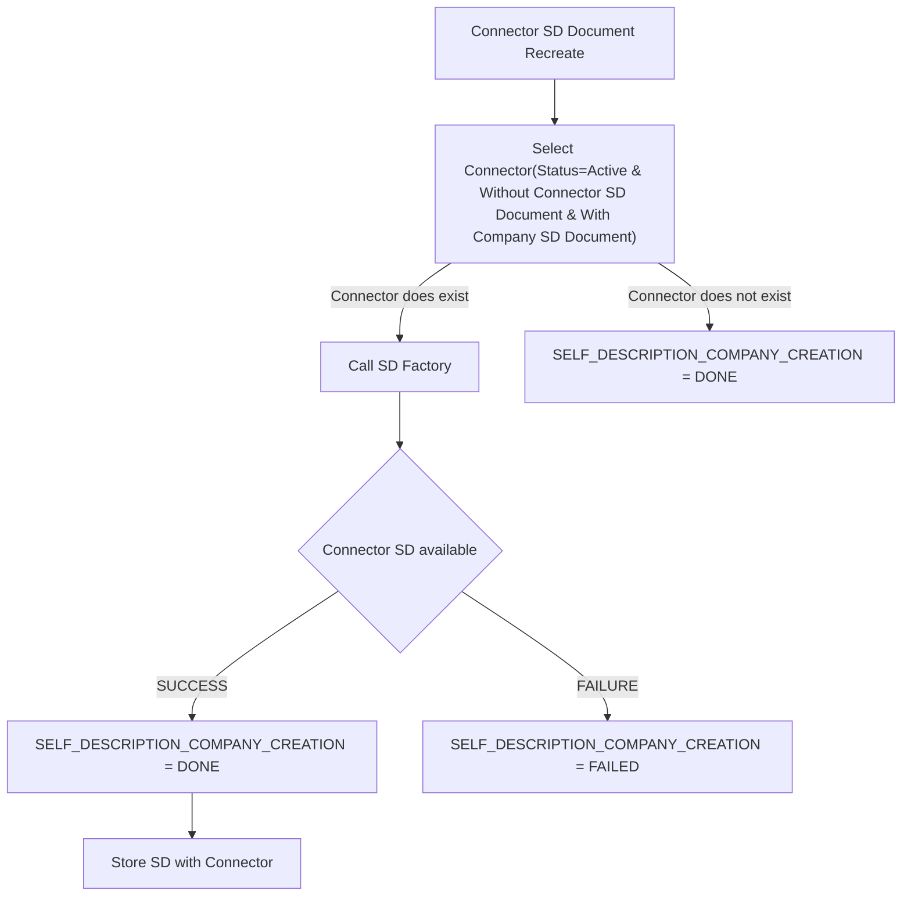

# Disable Clearinghouse connectivity for Self-Description (SD) functionalities

## Application Checklist Level

## Create Connector

## Trigger - Create Company SD Document

## Trigger - Create Connector SD Document

## NOTICE

This work is licensed under the [Apache-2.0](https://www.apache.org/licenses/LICENSE-2.0).

- SPDX-License-Identifier: Apache-2.0
- SPDX-FileCopyrightText: 2024 Contributors to the Eclipse Foundation
- Source URL: https://github.com/eclipse-tractusx/portal-assets