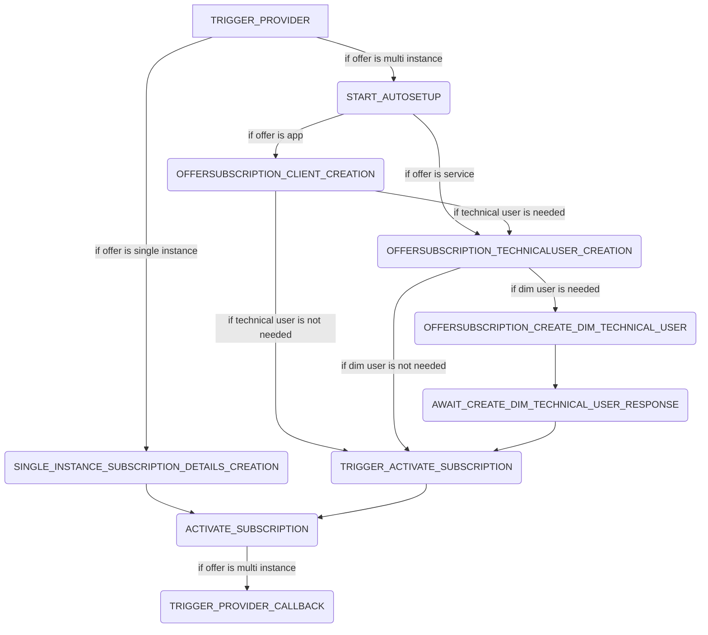

# Summary

The offer subscription process handles the subscription and automatic activation for an offer. The process steps are the following:

## External dependencies

The process worker communicates with the hoster of the offer if a callback url is set up.

## SYNCHRONIZE_USER

The process step `SYNCHRONIZE_USER` gets the identity providers for a specific network registration and creates the user in the central idp.

## TRIGGER_CALLBACK_OSP_SUBMITTED, TRIGGER_CALLBACK_OSP_APPROVED, TRIGGER_CALLBACK_OSP_DECLINED

The process steps `TRIGGER_CALLBACK_OSP_SUBMITTED`, `TRIGGER_CALLBACK_OSP_APPROVED`, `TRIGGER_CALLBACK_OSP_DECLINED` gets the necessary callback data from the database for a specific network registration. It handles the three cases for an application `SUBMITTED`, `APPROVED`, `DECLINED` and sends a callback to the osp. If the osp does not have a callback url configured the process step is skipped.

## REMOVE_KEYCLOAK_USERS

The process step `REMOVE_KEYCLOAK_USERS` is created when an network registration is declined. It will remove all keycloak users. It will proceed one user at a time and if more users are available for deletion it will create the same process step again.

## NOTICE

This work is licensed under the [Apache-2.0](https://www.apache.org/licenses/LICENSE-2.0).

- SPDX-License-Identifier: Apache-2.0
- SPDX-FileCopyrightText: 2024 Contributors to the Eclipse Foundation
- Source URL: https://github.com/eclipse-tractusx/portal-assets
