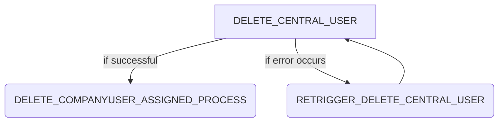

# Summary

The user provisioning process handles the cleanup of company users. It is triggered when declining an application The process steps are the following:

## External dependencies

The process worker communicates with the [centralidp](https://github.com/eclipse-tractusx/portal-iam/tree/main/charts/centralidp).

## DELETE_CENTRAL_USER

The process step `DELETE_CENTRAL_USER` deletes the company user from the central idp if it is available, otherwise the process step is skipped.

## DELETE_COMPANYUSER_ASSIGNED_PROCESS

The process steps `DELETE_COMPANYUSER_ASSIGNED_PROCESS` deletes the company user from the database.

## NOTICE

This work is licensed under the [Apache-2.0](https://www.apache.org/licenses/LICENSE-2.0).

- SPDX-License-Identifier: Apache-2.0
- SPDX-FileCopyrightText: 2024 Contributors to the Eclipse Foundation
- Source URL: https://github.com/eclipse-tractusx/portal-assets
