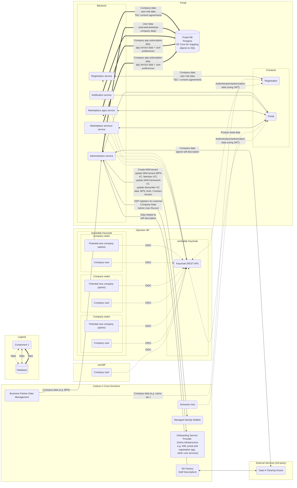

# Security Assessment Portal (incl. Frontend, Backend Services, IAM and other infrastructure)

|                           |                                                                                                |
| ------------------------- | ---------------------------------------------------------------------------------------------- |
| Contact for product       | [@evegufy](https://github.com/evegufy)   [@jjeroch](https://github.com/jjeroch)             |
| Security responsible      | [@SSIRKC](https://github.com/SSIRKC)   [Szymon Kowalczyk](szymon.kowalczyk.external@zf.com) |
| Version number of product | 23.12                                                                                          |
| Dates of assessment       | 2023-11-14: Re-Assessment                                                                      |
| Status of assessment      | RE-ASSESSMENT DRAFT                                                                            |

## Product Description

The Catena-X Portal and Marketplace is the heart of Catena-X and the entry point for all activities in the automotive network/value chain.
Every user of the automotive value chain, no matter if it is a consumer, app provider, IT administrator or IT support will connect via the portal to the value bringing services.
The whole eco-system on the automotive value chain is connected at one place.

- Portal Frame
- Partner Onboarding Process (initial, technical & business)
- Login Process
- User Management
- App Store
- Developer Platform
- UI / UX & Developer Guidelines

### Important Links

- [portal-frontend](https://github.com/eclipse-tractusx/portal-frontend)
- [portal-frontend-registration](https://github.com/eclipse-tractusx/portal-frontend-registration)
- [portal-shared-components](https://github.com/eclipse-tractusx/portal-shared-components)
- [portal-assets](https://github.com/eclipse-tractusx/portal-assets)
- [portal-backend](https://github.com/eclipse-tractusx/portal-backend)
- [portal-iam](https://github.com/eclipse-tractusx/portal-iam)

## Data Flow Diagram

### Changes compared to last Security Assessment

- No major architectural changes that introduce new threats.
- Main changes are connections to the onboarding service provider.

### Features for Upcoming Versions

- Integration of onboarding service provider endpoints.

## Threats & Risks

All threats identified are mitigated.

### Mitigated Threats

- Risks from Logging: Repudiation, Corrupted Logs, Compromised Audit Capabilities
  - Follow best practices for logging - ensure logs are being sent over a secure channel and that there is additional monitoring on logs originating from lower trust sources. Ensure the source of the logs is authenticated before accepting logs. Review substance of logs with security administrators and data protection officer. Integrity monitoring can be implemented at a later stage by the operator.
- Elevation by Changing the Execution Flow in Front-End, Out-of-band resource load (HTTP)
  - An operator should review the purpose and intended use of the relevant application functionality, and determine whether the ability to trigger arbitrary out-of-band resource load is intended behavior. If so, you should be aware of the types of attacks that can be performed via this behavior and take appropriate measures. These measures might include blocking network access from the application server to other internal systems, and hardening the application server itself to remove any services available on the local loopback adapter. You should also ensure that content retrieved from other systems is processed in a safe manner, with the usual precautions that are applicable when processing input from direct incoming web requests. If the ability to trigger arbitrary out-of-band resource load is not intended behavior, then you should implement a whitelist of permitted URLs, and block requests to URLs that do not appear on this whitelist.
- Cross Site Scripting (XSS) \* Input validation for both front ends would greatly reduce chances of this threat. Input should be sanitized syntactically and also be checked semantically.
  All variables go through validation and are then escaped or sanitized (confirmation needed). API call validation - best practice that is implemented. Output encoding - unsure on current implementation.
- Cross Site Request Forgery (XSRF)
  - Unique Session IDs, Anti-CSRF token, SSL/TLS implemented.
- Weakness in SSO Authorization Protocol
  - Mitigated with the standardized protocol implementation.
- Replay Attacks
  - Token validation in place and this threat was not discovered in the PenTest.
- Weak Authentication Scheme
  - Implementation of Password Policies for all Catena-X IdP users. The password policies need to get configured, tested and automated to have the possibility to run the configuration by new realm creation.
- SQL Injection - This issue is addressed within the capabilities of .NET and includes:
  - Parameterization
  - Input Validation
  - Other Framework Mechanisms (e.g. Query Builder Methods)
- Breach of Portal DB Information
  - Migrations .NET mechanisms applied (restrict the access)
  - No root or default users
  - All users are restricted (custom user, custom access restriction)
- Data Flow HTTPS Is Potentially Interrupted (Resource Overload)
  - Service Accounts for all APIs
  - Rate Limiting
- Process Crash
  - Availability implemented by having multiple pods in parallel (Check for pod failure + rolling updates)
  - Access to resources restricted by AAA mechanisms
  - Infrastructure measures applied like (in reference implementation), but this is covered by the operating company
- JavaScript Object Notation Processing / Hijacking Attacks
  - .NET parser implemented for JSON according to best practices
- K8s Breach
  - Kubernetes configured through Helm Chart, reviewed by KICS scan (scans for security vulnerabilities) - overall best practices to be managed by DevOps.
- Service Account Handling (Client Secret/ ID storage
  - Secrets are safely stored in KeyCloak
  - Secret handling is fully implemented on provider side (KeyCloak)
  - These measures are applied overall to all service accounts

### Performed Security Checks

- Static Application Security Testing (SAST) - VeraCode
- Dynamic Application Security Testing (DAST) - Invicti
- Secret Scanning - GitGuardian, GitHub, VeraCode
- Software Composition Analysis (SCA) - VeraCode
- Container Scan conducted - Trivy
- Infrastructure as Code - KICS

Also see [Penetrations Tests](../Tests/Tests.md#penetration-tests).

## NOTICE

This work is licensed under the [Apache-2.0](https://www.apache.org/licenses/LICENSE-2.0).

- SPDX-License-Identifier: Apache-2.0
- SPDX-FileCopyrightText: 2021-2023 Contributors to the Eclipse Foundation
- Source URL: https://github.com/eclipse-tractusx/portal-assets
