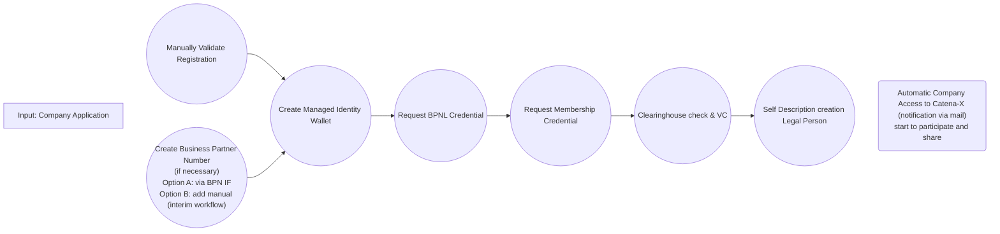
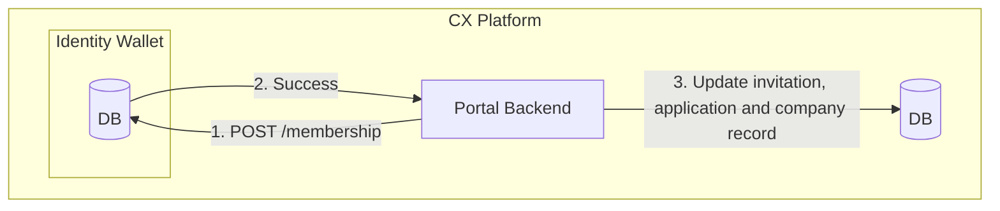

## Registration Approval Flow

The company registration approval flow is covering the manual and automatic check of the company application including the setup of the company to participate inside the dataspace.

The list below shows an overview of all application approval steps:



As high-level displayed above; the registration approval flow consist out of 7 steps. Which can partially run in parallel or must run in the predefined sequence.
The seven registration approval flow steps are implemented in a kind of checklist worker which automatically triggers the relevant services as per the current state of the company application. To ensure that the operator knows the status of the company application, each step can be in the status

- Open
- In Progress
- Done
- Failed

In case of a failed scenario; the error code (if available) is getting recorded for the registration application workflow step and can get viewed by the operator.

For the Self Description creation there was a special status `Skipped` introduced. This step is only set if the clearinghouseConnectDisabled is true.

### Checklist Stepper


By clicking on the process step overview on the right side, the overlay wth process step details gets displayed.
Depending on the status, the user can execute a number of actions / next steps. In general 3 action states are possible and defined below


<br>
<br>

##### Details "Manual Validation"

<br>
The "manual validation" checklist item is covering the company application validation by the operator. In this step the application gets manually checked and 'approved' or 'declined'.
Depending on the decision the checklist item "Registration_Verification" is set to DONE or FAILED.

In the scenario of FAILED, a comment/message can get submitted by the operator and provided/send via email to the company application party.
<br>
<br>

###### Scenario: Approve

The endpoint "approve" sets the "Registration_Verification" checklist item to "DONE".
The endpoint can only get triggered/executed if the application is in status "submitted" and the "Registration_Verification" in Status "TO_DO"
<br>

```diff
! PUT /api/administration/registration/application/{applicationId}/approve
```

<br>
<br>

###### Scenario: Decline

<br>

<br>

The administrator can decline the application if the application data are incorrect or incomplete.
The decline scenario is not reversible. The registration company will get informed about the rejection.
<br>
<br>

##### Details "Create Business Partner Number (if necessary)"

<br>
The status "Business_Partner_Number" is being updated based on the application registration content.

<br>
<br>

###### Scenario 1 - Registration with BPN

If the registration application is being submitted by the registration party for approval with a BPN, the checklist item "Business Partner Number" is set to "DONE".
In this case; nothing is needed anymore regarding the business partner number checklist item.
<br>
<br>

###### Scenario 2 - Registration without BPN

If the registration application is being submitted by the registration party for approval <strong>without an BPN</strong>, the checklist item "Business Partner Number" is kept in status "TO_DO"

In this case; the checklist item worker will fetch the application when running and submit the company data of the registration company to the business partner golden record gateway to validate the record and to generate a business partner number.
<br>

```diff
! POST /api/administration/registration/application/{applicationId}/trigger-BPN
```

the checklist item "Business Partner Number" is getting set to "IN_PROGRESS", until a BPN is received (currently not yet implemented)
<br>
<br>

    Please note - in the current implementation the BPN gate response does mainly handle success scenarios. In the Scenario of an fail (due to incorrect/not matching company data) the failure response is not yet available and will be delivered by the bpdm product team asap.

<br>
<br>

###### Scenario 3 - manually add BPN as operator (interim supported workflow)

For the interim process of the need to add the BPN of the new CX participant manually, the operator can use the endpoint to add the business partner number to the application.
This endpoint is an interim endpoint only and supposed to get disabled; as soon as the BPN Gateway is providing a stable feedback on the provided company data.
<br>

```diff
! POST /api/administration/registration/application/{applicationId}/{BPN}/BPN
```

<br>
<br>

##### Details "Create Managed Identity Wallet"

<br>
After the checklist item "Registration_Verification" status is set to "DONE", as well as the status of the "Business_Partner_Number" automatically the IF to the identity wallet is getting triggered to create the company identity wallet.
Details to the company identity wallet can be found inside the identity wallet product description.

With triggering the registration, the company name as well as the BPN are getting submitted and stored inside the company wallet.

Depending on the API response, the system will behave in the following way:

- Response "Fail" => store the error message in the checklist table under checklist.comment and set the status to "FAILED"
- Response "Success" => set status to "DONE" and store the did provided by the response body inside the comment attribute inside the table checklist.comment

  Please note: the scenario of "bring your own company wallet" is currently not supported and will get rechecked in H2 2023.

<br>
<br>

##### Details "Request BPNL Credential"

The "Request BPNL Credential" is getting automatically triggered when following prerequisites are met:

- application checklist status "Business_Partner_Number" = "DONE"
- application checklist status "Registration_Verification" = "DONE"
- application checklist status "Identity_Wallet" = "DONE"
- application checklist status "Request BPNL Credential" = "TO_DO"
- application is in status "submitted"

The BPNL Credential is requested via the SSI Credential Issuer, after successfully triggering the credential request the status of the checklist is set to `IN_PROGRESS`.

After the SSI Credential Issuer created the credential a callback is made:

```diff
! POST: api/administration/registration/issuer/BPNcredential
```

{
"BPN": "string",
"status": "string",
"message": "string"
}

The status can only get changed/updated; if the status of the application checklist attribute "request BPNl credential" is "IN_PROGRESS".

##### Details "Request Membership Credential"

The "Request Membership Credential" is getting automatically triggered when following prerequisites are met:

- application checklist status "Business_Partner_Number" = "DONE"
- application checklist status "Registration_Verification" = "DONE"
- application checklist status "Identity_Wallet" = "DONE"
- application checklist status "Request BPNL Credential" = "DONE"
- application checklist status "Request Membership Credential" = "TO_DO"
- application is in status "submitted"

The Membership Credential is requested via the SSI Credential Issuer, after successfully triggering the credential request the status of the checklist is set to `IN_PROGRESS`.

After the SSI Credential Issuer created the credential a callback is made:

```diff
! POST: api/administration/registration/issuer/membershipcredential
```

{
"BPN": "string",
"status": "string",
"message": "string"
}

The status can only get changed/updated; if the status of the application checklist attribute "request membership credential" is "IN_PROGRESS".

##### Details "Clearinghouse Check"

<br>
The "Clearinghouse Check" is getting automatically triggered when following prerequisites are met:
<br>

- application checklist status "Business_Partner_Number" = "DONE"
- application checklist status "Registration_Verification" = "DONE"
- application checklist status "Identity_Wallet" = "DONE"
- application is in status "submitted"
  <br>


<br>

The interface is an asynchronous interface - due to this, the interface is explained below in two steps

<br>
<br>

###### Step 1 - manually add BPN as operator (interim supported workflow)

```diff
PUT /api/administration/registration/application/{applicationId}/trigger-clearinghouse
```

Submitted body to clearinghouse endpoint (content is created on backend side only; no FE interaction)

        {
           "participantDetails": {
                "name": "string",
                "city": "string",
                "street": "string",
                "BPN": "string",
                "region": "string",
                "zipCode": "string",
                "country": "string",
                "countryAlpha2Code": "string"
               },
           "identityDetails": {
                "did": "string",
                "uniqueIds": [
                        {
                           "type": "string",
                           "value": "string"
                         }
                       ]
               }
          }

<br>
<br>

###### Step 2 - Clearinghouse response

In the asynchronous call of the clearinghouse check, the portal provides a POST endpoint, which can get triggered by the clearinghouse to update the checklist status.  
<br>

the clearinghouse need to be able to store an fail/success message. the message is supposed to be stored inside the checklist comment of the record attribute "clearing_house"
<br>

```diff
! POST: api/administration/registration/clearinghouse
```

        {
          "BPN": "string",
          "status": "string",
          "message": "string"
        }

The BPN inside the request body is used to fetch the correct application Id. (application in status "submitted")
The status can only get changed/updated; if the status of the application checklist attribute "clearing_house" is "IN_PROGRESS".

##### Details "Self-Description Creation LegalPerson"

The "Self_Description_Legal_Person" is getting automatically triggered when following prerequisites are met:

- application checklist status "Business_Partner_Number" = "DONE"
- application checklist status "Registration_Verification" = "DONE"
- application checklist status "Identity_Wallet" = "DONE"
- application checklist status "Request BPNL Credential" = "DONE"
- application checklist status "Request Membership Credential" = "DONE"
- application checklist status "Clearinghouse_Check" = "DONE"
- application checklist status "Self_Description_LP" = "TO_DO"
- application is in status "submitted"

Before executing the application checklist item a check for `clearinghouseConnectDisabled` is active, if `clearinghouseConnectDisabled` is true the status of the application checklist item is set to `SKIPPED` and the logic won't be executed.

With the endpoint, the SD Factory is triggered and a self description of the legal person is submitted back. The portal backend is storing the self-description inside the portal DB linked to the company.

With triggering the endpoint, the status of the checklist item "Self_Description_LP" is set to "IN_PROGRESS"

Response "Error" => store the error message in the checklist table under checklist.comment and set the status to "FAILED"  
Response "Success" => set status to "DONE"

        "registratioNumber": [

             {
               "type":"technicalKey",
               "value":"value from db"
             }
           ]

<br>

###### DB Table Content

| ID  | Portal DB Key         | Interface Key for SD |
| --- | --------------------- | -------------------- |
| 1   | COMMERCIAL_REG_NUMBER | local                |
| 2   | VAT_ID                | vatID                |
| 3   | LEI_CODE              | leiCode              |
| 4   | VIES                  | EUID                 |
| 5   | EORI                  | EORI                 |

<br>
<br>

##### Details "Activation"



<br>
The complete company account activation (as result of the successful application checklist finalization) is automatically executed when following pre-requisites are fulfilled:
<br>

- application checklist status "Business_Partner_Number" = "DONE"
- application checklist status "Registration_Verification" = "DONE"
- application checklist status "Identity_Wallet" = "DONE"
- application checklist status "Request BPNL Credential" = "DONE"
- application checklist status "Request Membership Credential" = "DONE"
- application checklist status "Clearinghouse_Check" = "DONE"
- application checklist status "Self_Description_LP" = "DONE"
- application is in status "submitted"
  <br>

With the execution of the application activation, the system will:

- set company status inside portal.companies to "ACTIVE"
- set application status inside portal.company_application to"CONFIRMED"
- set company_application time stamp
- set invitation of all users to "CLOSED"
- set invitation time stamp
- update user roles (portal db and Keycloak)
- add BPN to user(s)
- send welcome email

### Add/Update BPN for the registration company

<br>
The BPN can be manually added (as a workaround) if the registration company request doesn't have a business partner number added and the registration request is in status "submitted".
<br>

<br>
BPNs can only be added by CX Admin's.
As mentioned above, the implementation is a workaround only and will get replaced by the actual BPN connection as soon as the reference implementation is available.
<br>
<br>

## NOTICE

This work is licensed under the [Apache-2.0](https://www.apache.org/licenses/LICENSE-2.0).

- SPDX-License-Identifier: Apache-2.0
- SPDX-FileCopyrightText: 2023 Contributors to the Eclipse Foundation
- Source URL: https://github.com/eclipse-tractusx/portal-assets
